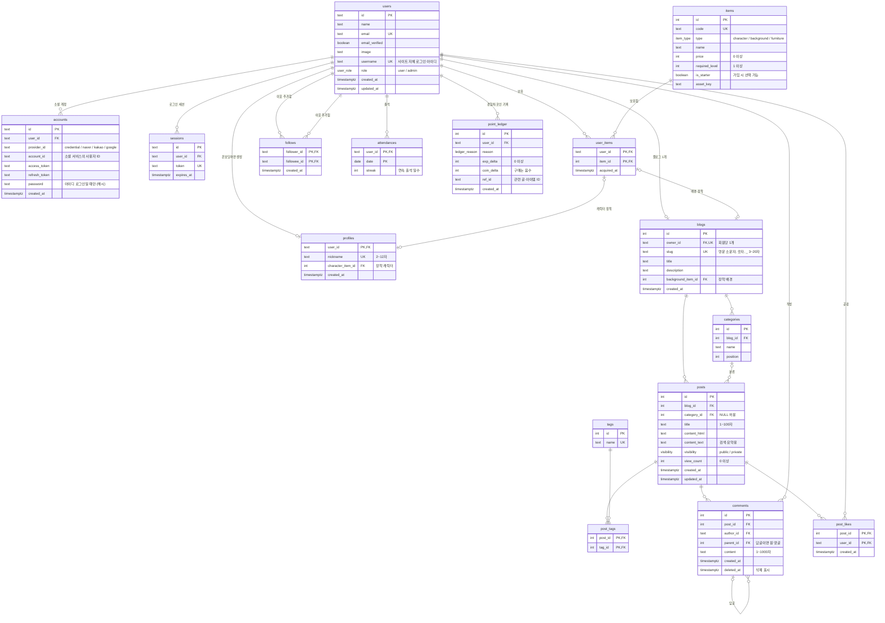

# Blogville ERD (데이터베이스 설계)

- DB: PostgreSQL
- 버전: 0.3 (2026-10-02, 사이트 자체 로그인·관리자 추가)
- 근거: [요구사항 명세서](01-requirements.md)

## 1. 전체 관계도



## 2. 테이블 그룹

| 그룹 | 테이블 | 관련 요구사항 |
|---|---|---|
| 인증 | `users`, `accounts`, `sessions`, `verifications` | AUTH |
| 회원·블로그 | `profiles`, `blogs`, `categories` | AUTH-02, BLOG |
| 글·교류 | `posts`, `tags`, `post_tags`, `comments`, `post_likes`, `follows` | POST, SOC |
| 아이템 | `items`, `user_items` | GAME-01, SHOP |
| 보상 | `attendances`, `point_ledger` | GAME-02~05 |

인증 테이블 4개는 로그인 라이브러리(Better Auth)가 정한 구조를 따르고, 나머지는 직접 설계했다.
`verifications`는 로그인 과정의 임시 값을 담는 라이브러리 내부용이라 관계도에서 뺐다.

## 3. 설계 결정

### 3.1 회원과 프로필을 나눈 이유

`users`는 "로그인할 수 있는 사람", `profiles`는 "온보딩을 마친 마을 주민"이다.

- 소셜 로그인 직후에는 `users`만 있고 `profiles`가 없다 → **온보딩이 필요한 상태**를 별도 컬럼 없이 알 수 있다.
- 로그인 라이브러리 테이블을 건드리지 않아서, 라이브러리를 업데이트해도 우리 데이터 구조가 깨지지 않는다.

### 3.1-2 로그인 방식이 여러 개여도 회원은 하나

- 사이트 아이디로 가입하면 `users.username`에 아이디, `accounts`에 `provider_id = 'credential'` 행과 비밀번호 **해시**가 저장된다.
- 소셜 로그인은 같은 `accounts` 테이블에 `provider_id = 'kakao'` 같은 행으로 저장된다.
- 그래서 "회원 1명 ── 로그인 수단 N개" 구조가 된다. 비밀번호 원문은 어디에도 저장하지 않는다.
- 관리자는 `users.role = 'admin'`. 가입 요청으로는 바꿀 수 없고 관리자 생성 스크립트로만 정한다.

### 3.2 회원 한 명당 블로그 하나 (1:1)

`blogs.owner_id`에 **UNIQUE**를 걸어서 1:1 관계를 DB가 보장한다. (AUTH-01, BLOG-01)

### 3.3 장착은 "보유한 아이템"만: 복합 외래 키

`profiles.character_item_id`가 그냥 `items.id`를 가리키면, **사지 않은 아이템도 장착**할 수 있다.
그래서 `(user_id, character_item_id)` 두 컬럼을 묶어서 `user_items (user_id, item_id)`를 가리키게 한다.

```sql
FOREIGN KEY (user_id, character_item_id) REFERENCES user_items (user_id, item_id)
FOREIGN KEY (owner_id, background_item_id) REFERENCES user_items (user_id, item_id)
```

"보유한 것만 장착 가능"(SHOP-04)이라는 규칙을 앱 코드가 아니라 **DB가 직접 막는다.**
다만 "캐릭터 칸에는 캐릭터 아이템만"이라는 종류 검사는 서버 코드에서 한다.

### 3.4 코인과 경험치는 저장하지 않고 원장에서 계산 (정규화)

`profiles`에 `coins`, `exp` 컬럼을 두지 않는다. 대신 모든 변화를 `point_ledger`에 한 줄씩 쌓는다.

```sql
-- 현재 코인과 경험치
SELECT COALESCE(SUM(coin_delta), 0) AS coins,
       COALESCE(SUM(exp_delta), 0)  AS exp
FROM point_ledger WHERE user_id = $1;
```

- 잔액 컬럼과 기록이 어긋날 일이 없다. 은행 통장의 거래 내역과 같은 방식이다.
- "언제 무엇으로 얼마를 받았는지"를 그대로 보여줄 수 있다.
- **레벨도 저장하지 않는다.** 경험치 합계로 계산한다.

**레벨 공식**: 레벨 n이 되려면 누적 경험치 `50 × n × (n − 1)` 이상

| 레벨 | 1 | 2 | 3 | 4 | 5 | 10 |
|---|---|---|---|---|---|---|
| 필요 경험치 | 0 | 100 | 300 | 600 | 1,000 | 4,500 |

### 3.5 하루 상한과 출석

- **출석**: `attendances`의 기본 키가 `(user_id, date)`라서 같은 날 두 번 넣으면 DB가 거부한다. 버튼을 동시에 두 번 눌러도 한 번만 처리된다. (NF-05)
- **활동 보상 상한**: 오늘 같은 사유로 받은 보상 수를 `point_ledger`에서 세어 확인한다.

```sql
SELECT COUNT(*) FROM point_ledger
WHERE user_id = $1 AND reason = 'post' AND created_at >= 오늘 0시;
```

### 3.6 코인은 음수가 될 수 없다

구매는 **트랜잭션** 안에서 처리한다. (NF-04, SHOP-03)

```text
BEGIN
  1. pg_advisory_xact_lock(hashtext(user_id))  ← 이 회원의 보상·구매를 한 줄로 세운다
  2. 원장 합계로 잔액·레벨 계산
  3. 잔액 < 가격 또는 레벨 부족이면 중단
  4. user_items에 아이템 추가 (이미 있으면 기본 키 위반 → ROLLBACK)
  5. point_ledger에 coin_delta = -가격 기록
COMMIT
```

> 처음에는 원장 행을 `FOR UPDATE`로 잠그려 했지만, 원장은 "행을 추가"하는 테이블이라 아직 없는 행은 잠글 수 없다.
> 그래서 회원 ID로 만든 **advisory lock**(트랜잭션이 끝나면 자동으로 풀리는 이름표 잠금)을 쓴다.
> 같은 방식으로 출석, 글·댓글·공감 보상의 하루 상한 확인도 동시에 두 번 처리되지 않는다.

### 3.7 다대다(N:M) 관계

| 연결 테이블 | 잇는 것 | 기본 키 |
|---|---|---|
| `post_tags` | 글 ↔ 태그 | `(post_id, tag_id)` |
| `post_likes` | 글 ↔ 공감한 회원 | `(post_id, user_id)` → 한 글에 한 번만 공감 (SOC-03) |
| `user_items` | 회원 ↔ 아이템 | `(user_id, item_id)` → 같은 아이템 중복 보유 불가 |
| `follows` | 회원 ↔ 회원 (자기 참조) | `(follower_id, followee_id)` |

`follows`에는 `CHECK (follower_id <> followee_id)`로 자기 자신을 이웃 추가하지 못하게 한다.

### 3.8 삭제 규칙

| 지워지는 것 | 함께 처리 |
|---|---|
| 회원 | 프로필, 블로그, 글, 댓글, 공감, 원장 모두 삭제 (`CASCADE`) (AUTH-06) |
| 블로그 | 카테고리, 글 삭제 |
| 글 | 태그 연결, 댓글, 공감 삭제 |
| 카테고리 | 글은 남기고 `category_id`만 비움 (`SET NULL`) |
| 댓글 | 답글이 있을 수 있으니 행을 지우지 않고 `deleted_at`만 기록 ("삭제된 댓글입니다") |

### 3.9 열거형 (ENUM)

| 타입 | 값 |
|---|---|
| `user_role` | `user`, `admin` |
| `item_type` | `character`, `background`, `furniture` |
| `visibility` | `public`, `private` |
| `ledger_reason` | `signup`, `attendance`, `attendance_streak`, `post`, `comment`, `like_received`, `purchase` |

정해진 값만 들어가도록 PostgreSQL ENUM 타입을 쓴다. 어제 SQLite 블로그에서 `post_types` 코드 테이블로 했던 일을 DB 타입으로 처리하는 방법이다.

### 3.10 인덱스

| 인덱스 | 쓰이는 곳 |
|---|---|
| `posts (blog_id, created_at DESC)` | 블로그 홈 글 목록 |
| `posts (visibility, created_at DESC)` | 마을 최신 글 |
| `comments (post_id, created_at)` | 글 상세 댓글 |
| `point_ledger (user_id, reason, created_at)` | 잔액 계산, 하루 상한 확인 |
| `point_ledger (user_id, created_at DESC)` | 경험치·코인 내역 화면 최신순 (GAME-07, 마이그레이션 0003) |
| `follows (followee_id)` | 나를 이웃 추가한 사람 |

## 4. 데이터 마이그레이션

구조가 아니라 **데이터**를 바꿔야 할 때도 마이그레이션 파일로 남긴다. 그래야 팀원 각자의 DB와 배포 DB에 똑같이 적용된다.

| 파일 | 내용 |
|---|---|
| `0002_give_all_starters.sql` | GAME-01 결정(기본 캐릭터 3종 모두 지급)에 맞춰, 이미 온보딩을 마친 회원에게 없는 기본 캐릭터를 `user_items`에 채운다. `ON CONFLICT DO NOTHING`이라 여러 번 실행해도 중복되지 않는다 |

## 5. 남은 확인 사항

- **카카오 로그인 이메일**: 카카오는 이메일 제공이 선택 동의라 이메일이 없을 수 있다. 로그인 라이브러리가 이메일을 필수로 요구하는지 구현할 때 확인한다.
- **같은 블로그의 카테고리인지 검사**: 글의 `category_id`가 그 글의 블로그 카테고리인지는 서버 코드에서 검사한다.
