# Blogville ERD (데이터베이스 설계)

- DB: PostgreSQL
- 버전: 1.13 (2026-10-11, 미용실·옷가게: `avatar_slot`에 `hair`(머리 모양)·`hair_color`(머리 색), 마이그레이션 0031). 1.12 (2026-10-09, 광장 꾸미기 `town_decorations`, 아이템 종류 `deco`). 1.11 (2026-10-08, 연못 낚시터 `fishing_catches`, 원장 사유 `fishing`). 1.10 (2026-10-08, SHOP: 아바타 꾸미기 `avatar_equips`, `items.avatar_slot`·`growth_value`·`is_on_sale`, `user_items.quantity`, 성장 아이템). 1.9 (2026-10-08, 마을 개편 2차: 집 안 가구 `house_furniture`, 가구 아이템 8종). 1.8 (2026-10-08, 캐릭터/성장: 자동 출석 `attendances.cycle_day`·`session_id`·`checked_at`, 일차별 보상표 `attendance_rewards`, 출석 보상 원장 부분 고유 인덱스, 알림 표 `notifications`·`notification_kind`)
- 1.7 (2026-10-08, 교류: 답글 표 `replies` 분리·`comments.parent_id` 삭제, 탈퇴하면 `comments.author_id` NULL, 삭제하면 내용 비움, `follows.is_favorite`)
- 1.6 (2026-10-08, 글: 첨부를 글에 잇기 `attachments.post_id`·`detached_at`, 조회 기록 `post_views`, 글의 소분류 `posts.subcategory_id`와 트리거)
- 근거: [요구사항 명세서](01-requirements.md)
- ERDCloud 가져오기용 SQL: [erdcloud-import.sql](erdcloud-import.sql) (테이블 25개, MySQL 문법. `login_attempts`·`post_views`·`notifications`는 아직 없다)
- ERDCloud에서 직접 그린 제출본: [erdcloud-final.sql](erdcloud-final.sql) (2026-10-07 내보내기. 점선 관계의 FK와 테이블 코멘트는 ERDCloud가 내보내지 않는다)

> 이 문서는 **결정된 설계**다. 아직 코드(DB)에 반영되지 않은 부분은 ⏳로 표시했고, 지금 DB와 다른 점은 [7장](#7-지금-db와-다른-점-구현할-일)에 모았다.

## 1. 전체 관계도

엔티티(회원, 글, 댓글처럼 스스로 존재하는 것)는 자기 번호 `id`가 PK이고 **비식별 관계**(점선 `..`)다. 둘을 잇는 표와 "하루 한 번" 기록은 부모 키를 묶은 **복합 PK**를 써서 **식별 관계**(실선)다. 복합 PK가 규칙(한 번만, 하루 한 번)을 그대로 지켜서 더 단순하기 때문이다 (3.7). 정규화 점검은 3.17.

```mermaid
erDiagram
    users ||--|| profiles : "가입 때 함께 생성"
    users ||..|| blogs : "가입 때 함께 생성"
    users ||..o{ accounts : "아이디 1 + 연동한 소셜"
    users ||..o{ sessions : "로그인 세션"

    users ||--o{ user_items : "보유"
    items ||--o{ user_items : "보유됨"
    user_items |o..o| profiles : "캐릭터 장착"
    user_items |o..o| blogs : "배경 장착"
    attachments |o..o| profiles : "프로필 사진"

    blogs ||..o{ categories : ""
    blogs ||..o{ posts : ""
    categories |o..o{ posts : "대분류"
    categories ||..o{ subcategories : "소분류 (2단계)"
    subcategories |o..o{ posts : "소분류"
    posts |o..o{ attachments : "글 첨부"
    users ||..o{ attachments : "올린 사람"

    posts ||--o{ post_tags : ""
    tags ||--o{ post_tags : ""
    posts ||..o{ comments : ""
    comments ||..o{ replies : "답글 (1단계)"
    users ||..o{ comments : "작성"
    users ||..o{ replies : "작성"
    posts ||--o{ post_likes : ""
    users ||--o{ post_likes : "공감"
    users ||--o{ follows : "이웃 추가함"
    users ||--o{ follows : "이웃 추가됨"
    blogs ||--o{ blog_visits : "방문 기록"
    posts ||--o{ post_views : "조회 기록"

    users ||--o{ attendances : "출석"
    sessions |o..o{ attendances : "자동 출석한 세션"
    attendance_rewards ||..o{ attendances : "그날 일차의 보상"
    users ||..o{ point_ledger : "경험치·코인 기록"
    users ||..o{ notifications : "받은 알림"
    users |o..o{ notifications : "행동한 회원"
    posts |o..o{ notifications : "관련 글"
    user_items ||..o{ house_furniture : "집 안에 놓은 가진 가구"
    user_items ||..o{ town_decorations : "광장에 놓은 가진 장식"
    user_items ||..o{ avatar_equips : "입은 가진 아바타 아이템"

    users ||..o{ user_animals : "알·동물"
    animal_species |o..o{ user_animals : "종류 (알이면 없음)"
    user_animals ||--o{ animal_cares : "돌보기 기록"
    user_animals |o..o| blogs : "전시 동물 (다 키운 동물 1마리)"

    users {
        varchar id PK
        varchar name
        varchar email UK
        boolean email_verified
        varchar image "소셜 프로필 사진 주소"
        varchar username UK "사이트 아이디 (모두 가짐, 소문자)"
        varchar display_username
        user_role role "user / admin"
        timestamptz created_at
        timestamptz updated_at
    }
    accounts {
        varchar id PK
        varchar user_id FK "UK(user_id, provider_id)"
        varchar provider_id "credential / kakao / naver / google"
        varchar account_id "UK(provider_id, account_id)"
        text access_token
        text refresh_token
        text id_token
        varchar password "credential만, 해시"
        timestamptz created_at
    }
    sessions {
        varchar id PK
        varchar user_id FK
        char token UK "쿠키에 담기는 값"
        timestamptz expires_at
        boolean remember_me "로그인 상태 유지 (2시간 / 7일)"
        varchar ip_address
        varchar user_agent
        timestamptz created_at
        timestamptz updated_at
    }
    login_attempts {
        varchar username PK "정규화한 입력 (없는 아이디도)"
        int failed_count "연속 실패 수"
        timestamptz locked_until "잠금 해제 시각, NULL 허용"
        timestamptz updated_at
    }
    verifications {
        varchar id PK
        varchar identifier
        varchar value
        timestamptz expires_at
    }
    profiles {
        varchar user_id PK,FK
        varchar nickname UK "2~20자, 가입 때 아이디로 자동"
        int character_item_id FK
        char photo_key FK "프로필 사진, NULL 허용"
        timestamptz created_at
    }
    blogs {
        int id PK
        varchar owner_id FK,UK
        varchar slug UK "/@주소, 가입 때 아이디로 자동"
        varchar title "가입 폼에 적은 이름 1~40자"
        varchar description
        int background_item_id FK
        int showcase_animal_id FK "전시 동물, NULL 허용"
        varchar roof_color "집 지붕 색 10색, NULL = 처음 받은 무작위 색"
        timestamptz created_at
        timestamptz updated_at
    }
    categories {
        int id PK
        int blog_id FK "UK(blog_id, name)"
        varchar name "대분류 이름"
        smallint position
    }
    subcategories {
        int id PK
        int category_id FK "UK(category_id, name), UK(category_id, id)"
        varchar name "소분류 이름"
        smallint position
    }
    posts {
        int id PK
        int blog_id FK
        int category_id FK "대분류, NULL 허용"
        int subcategory_id FK "소분류, NULL 허용"
        varchar title
        text content_html
        text content_text
        visibility visibility "public / private"
        int view_count
        timestamptz created_at
        timestamptz updated_at
    }
    tags {
        int id PK
        varchar name UK
    }
    post_tags {
        int post_id PK,FK
        int tag_id PK,FK
    }
    comments {
        int id PK
        int post_id FK
        varchar author_id FK "탈퇴하면 NULL"
        varchar content
        timestamptz created_at
        timestamptz deleted_at "소프트 삭제"
    }
    replies {
        int id PK
        int comment_id FK
        varchar author_id FK
        varchar content
        timestamptz created_at
        timestamptz deleted_at
    }
    post_likes {
        int post_id PK,FK
        varchar user_id PK,FK
        timestamptz created_at
    }
    follows {
        varchar follower_id PK,FK
        varchar followee_id PK,FK
        boolean is_favorite "즐겨찾는 이웃 (최대 10)"
        timestamptz created_at
    }
    items {
        int id PK
        varchar code UK
        item_type type "character / background / furniture / avatar / growth / deco"
        avatar_slot avatar_slot "아바타만: hat / outfit / accessory / hair / hair_color"
        varchar name
        varchar description
        int price
        smallint required_level
        boolean is_starter
        varchar asset_key
        int growth_value "성장 아이템만, 쓰면 오르는 성장치"
        boolean is_on_sale "상점에서 파는지 (캐릭터·기본 아이템은 false)"
        timestamptz created_at
    }
    avatar_equips {
        varchar user_id PK,FK
        avatar_slot slot PK "부위마다 하나"
        int item_id FK
        timestamptz equipped_at
    }
    user_items {
        varchar user_id PK,FK
        int item_id PK,FK
        int quantity "가진 개수 (먹이는 쓰면 줄어듦)"
        timestamptz acquired_at
    }
    attendances {
        varchar user_id PK,FK
        date date PK "한국 날짜"
        smallint cycle_day FK "1~7일차"
        varchar session_id FK "NULL 허용"
        timestamptz checked_at
    }
    attendance_rewards {
        smallint day PK "1~7"
        int exp
        int coins
    }
    point_ledger {
        bigint id PK
        varchar user_id FK
        ledger_reason reason
        int exp_delta "0 이상"
        int coin_delta "쓰면 음수"
        varchar ref_id "관련 행 ID (FK 아님)"
        timestamptz created_at
    }
    notifications {
        int id PK
        varchar user_id FK "받는 회원"
        notification_kind kind "level_up / like / comment / reply"
        varchar actor_id FK "행동한 회원, 레벨업은 NULL"
        int post_id FK "관련 글, 레벨업은 NULL"
        smallint level "레벨업만, 2~99"
        timestamptz created_at
        timestamptz read_at "NULL = 안 읽음"
    }
    attachments {
        char key PK "무작위 32자 = 주소 /files/키"
        varchar user_id FK "올린 사람"
        int post_id FK "붙은 글, 쓰는 중이면 NULL"
        varchar kind "image / file"
        varchar name "원래 파일 이름"
        varchar mime
        int size "바이트"
        timestamptz detached_at "글에서 떨어진 시각"
        timestamptz created_at
    }
    post_views {
        int post_id PK,FK
        date date PK
        uuid visitor_id PK "방문자 쿠키"
        timestamptz created_at
    }
    blog_visits {
        int blog_id PK,FK
        date date PK
        uuid visitor_id PK "방문자 쿠키"
        timestamptz created_at
    }
    animal_species {
        int id PK
        varchar code UK
        varchar name
        varchar asset_key
        int grow_exp
        int reward_exp
        int reward_coins
        smallint hatch_weight
    }
    user_animals {
        int id PK
        varchar user_id FK "UK(user_id, id): 전시 FK용"
        int species_id FK "알이면 NULL"
        animal_status status "egg / growing / grown"
        int growth
        egg_source source "starter / level / shop"
        smallint source_level
        timestamptz created_at
        timestamptz hatched_at
        timestamptz grown_at
    }
    animal_cares {
        int animal_id PK,FK
        care_action action PK "feed / water / pet"
        date date PK
        timestamptz created_at
    }
```



`verifications`는 로그인 과정의 임시 값을 담는 라이브러리 내부용이라 다른 테이블과 관계가 없다.
`login_attempts`도 다른 테이블과 관계가 없다. 없는 아이디의 실패도 기록해야 해서 `users`와 FK를 두지 않는다 (3.19).

## 2. 테이블 그룹

| 그룹 | 테이블 | 관련 요구사항 |
|---|---|---|
| 인증 | `users`, `accounts`, `sessions`, `verifications`, `login_attempts` | AUTH |
| 회원·블로그 | `profiles`, `blogs`, `categories`, `subcategories` | AUTH-02, AUTH-07, BLOG |
| 글·교류 | `posts`, `tags`, `post_tags`, `comments`, `replies`, `post_likes`, `follows`, `post_views` | POST, SOC, TOWN-08 |
| 아이템 | `items`, `user_items` | GAME-01, SHOP, TOWN-09(성장 아이템) |
| 보상 | `attendances`, `attendance_rewards`, `point_ledger`, `notifications` | GAME-02~05, GAME-06, GAME-08 |
| 첨부 | `attachments` | POST-07, POST-09 |
| 방문자 | `blog_visits` | BLOG-06 |
| 동물 농장 | `animal_species`, `user_animals`, `animal_cares` | TOWN-09 |

인증 테이블 중 `users`·`accounts`·`sessions`·`verifications`는 로그인 라이브러리(Better Auth)가 정한 구조를 따르고(칸 몇 개를 더했다), `login_attempts`와 나머지는 직접 설계했다.

## 3. 설계 결정

### 3.1 가입하면 프로필·블로그가 자동으로 생긴다 (회원당 블로그 1개 필수)

- `users`는 "로그인할 수 있는 사람", `profiles`는 "마을 주민(닉네임·장착 캐릭터)", `blogs`는 "내 집(블로그)"이다. 로그인 라이브러리 테이블(`users`)을 건드리지 않으려고 셋을 나눴다.
- **회원가입 화면은 아이디·비밀번호·블로그 이름(과 캐릭터 고르기)을 받는다** (블로그 이름은 2026-10-11부터). 가입 트랜잭션이 `users`·`accounts`(credential)·`profiles`·`blogs`·기본 아이템을 한 번에 만들고, 이름은 **기본값을 쥐어 준다**:

  | 값 | 기본값 | 나중에 바꾸는 곳 |
  |---|---|---|
  | 닉네임 | 아이디 (`jinhaeng`) | 내 정보 |
  | 블로그 이름 | 가입 폼에 적은 값 (칸은 `{아이디}의 블로그`로 채워져 있다, 1~40자) | 블로그 관리 (BLOG-03) |
  | 블로그 주소 | `/@{아이디}` (아이디와 블로그 주소 규칙이 같다: 영문 소문자·숫자·_) | 블로그 관리 (예전 주소 링크는 끊긴다) |
  | 블로그 소개 | 빈 값 | 블로그 관리 |

  아이디는 이미 겹치지 않으므로 기본 닉네임·주소도 가입 순간에는 겹치지 않는다. 닉네임 길이는 아이디(4~20자)를 담도록 **2~20자**로 넓혔다 (`profiles_nickname_check`).
- 가입 트랜잭션 순서 (`src/server/signup.ts` `createMember`): 이름 잠금(`lockName`) → 남의 아이디·주소·닉네임과 겹치는지 확인 → `users` → `accounts`(credential, 해시) → 그 아이디의 `login_attempts` 행 삭제 → `user_items`(고른 캐릭터·초원) → `profiles` → `blogs` → `categories`("일상") → 가입 축하 코인(원장). 이름 잠금은 가입과 닉네임·주소 변경을 한 줄로 세워, 동시에 같은 이름을 잡아도 하나만 성공한다. 하나라도 실패하면 전부 롤백된다.
- 온보딩 단계는 없다 (AUTH-02를 AUTH-07에 합침).
- **회원당 블로그 1개 필수**: `blogs.owner_id` **UNIQUE**가 "많아야 1개"를, 가입 트랜잭션이 "반드시 1개"를 지킨다. FK로는 "회원 → 블로그가 반드시 있다"를 강제할 수 없어서(서로 먼저 있어야 하는 문제), 블로그만 지우는 기능을 두지 않는 것으로 막는다. 회원을 지우면 블로그도 함께 지워진다.
- 그래서 관계도는 `users ||--|| profiles`, `users ||--|| blogs`로 그린다.
- `profiles`는 회원과 1:1이라 `user_id`를 그대로 PK로 쓴다 (식별 관계, 3.7).
- 프로필(닉네임, 프로필 사진, 장착 캐릭터)은 광장뿐 아니라 **블로그에서도** 보여준다. 블로그 주인으로 바로 찾으므로(`blogs.owner_id = profiles.user_id`) 따로 잇지 않는다.

### 3.2 로그인: 아이디로 가입하고, 소셜 계정은 연동한다

- 모든 회원은 **사이트 아이디로 가입**한다 → `users.username`은 **NOT NULL** + CHECK `users_username_check` (`^[a-z0-9_]{4,20}$`). 소문자만 저장하므로 UNIQUE가 곧 대소문자 무시 유일이다. 가입하면 `accounts`에 `provider_id = 'credential'` 행과 비밀번호 **해시**가 생긴다. 비밀번호 원문은 어디에도 없다.
- 소셜 계정(카카오·네이버·구글)은 로그인한 뒤 내 정보에서 **연동**할 때 `accounts`에 행이 더해진다. 소셜로 새로 가입하지는 않는다 (AUTH-01, AUTH-05). 해제하면 그 행만 지운다 (`credential` 행은 지울 수 없다).
- 소셜 행에는 토큰을 두지 않는다: `access_token`·`refresh_token`·`id_token`·두 만료 칸·`scope`는 늘 NULL (우리 서비스는 소셜 API를 부르지 않는다, FR-035). 남는 것은 `provider_id`, `account_id`, 연동한 날짜 `created_at`.
- 회원 1명 ── 로그인 수단 1~4개 (아이디 1 + 서비스마다 0~1).
  - **UNIQUE (`user_id`, `provider_id`)** (`accounts_user_provider_uq`): 한 회원에 같은 서비스는 하나만
  - **UNIQUE (`provider_id`, `account_id`)**: 소셜 계정 하나는 한 회원에만
- 이메일은 라이브러리 필수 칸이라 가입 때 `{아이디}@users.blogville.invalid`를 넣는다 (메일을 보내지 않고 화면에 나오지 않는다). 소셜 계정용 대체 이메일은 로그인 과정에서만 쓰고 저장하지 않는다 (소셜로 회원을 만들지 않으므로).
- 관리자는 `users.role = 'admin'`. 가입 요청으로는 바꿀 수 없고 관리자 생성 스크립트로만 정한다.

### 3.3 세션(`sessions`)이 왜 필요한가

웹은 요청마다 서버가 처음 보는 사람처럼 대한다. 페이지를 열 때마다 비밀번호를 다시 보낼 수는 없다. 그래서:

1. 로그인에 성공하면 서버가 무작위 **토큰**을 만들어 `sessions`에 한 줄 저장하고, 같은 토큰을 브라우저 **쿠키**에 넣는다.
2. 다음 요청부터 브라우저가 쿠키를 자동으로 보내고, 서버는 `sessions`에서 토큰을 찾아 **누구인지, 아직 유효한지(`expires_at`)** 확인한다.

토큰을 DB에 두기 때문에:
- **로그아웃이 된다**: 행을 지우면 그 쿠키는 바로 쓸모없어진다.
- **기기별 로그인**: 휴대폰·노트북마다 행이 따로 있다 (`ip_address`, `user_agent`로 어떤 기기인지 안다).
- **만료와 연장**: `sessions.remember_me`가 [로그인 상태 유지] 여부다 (요청으로는 정할 수 없고 로그인할 때 서버가 정한다).
  - 유지 안 함(기본, 가입 직후 포함): `expires_at` = 지금 + **2시간**, 쿠키는 만료일이 없어 **브라우저를 닫으면 로그아웃**. 쓰는 동안 `getSession()`(`src/server/dal.ts`)이 **5분 단위**로 `expires_at = now() + 2시간`, `updated_at = now()`로 늘린다. 마지막 사용(`updated_at`) 뒤 2시간이 지나면 `expires_at`과 상관없이 행을 지우고 로그아웃으로 처리한다.
  - 유지: `expires_at` = 지금 + **7일**, 쿠키 Max-Age 7일. 화면의 `SessionKeeper`가 `GET /api/auth/get-session`을 불러 라이브러리가 1시간 단위로 다시 7일로 늘린다 (Route Handler라 쿠키도 다시 심는다).
  - 서버는 창이 닫힌 것을 알 수 없어서 세션 행과 만료 시간은 여전히 필요하다.
- **자동 출석**: 그날 처음 들어온 세션이 출석을 만들고, `attendances.session_id`가 그 세션을 가리킨다 (3.12).

회원 1명 ── 세션 0..N개.

### 3.19 로그인 실패 기록 (`login_attempts`)

- 같은 아이디로 **5번 연속** 실패하면 **5분** 동안 그 아이디의 아이디·비밀번호 로그인을 막는다 (AUTH-09). 규칙 숫자는 DB가 아니라 `src/lib/login-limit.ts`에 둔다 (CHECK에 넣으면 숫자를 바꿀 때 마이그레이션이 필요하다).
- PK는 정규화한 입력 아이디(`username`, 1~64자 CHECK). **`users`와 FK를 두지 않는다**: 없는 아이디도 똑같이 세야 아이디가 있는지 드러나지 않는데, FK가 있으면 없는 아이디를 기록할 수 없다.
- FK가 없어 회원 삭제의 `CASCADE`로 지워지지 않는다. 코드가 지운다: 로그인 성공, 그 아이디로 가입, 그 회원의 탈퇴. 개발 초기화(`npm run db:reset`)도 따로 비운다.
- 비밀번호를 확인하기 **전에** 짧은 트랜잭션으로 이번 시도를 실패로 미리 센다(같은 아이디는 advisory lock으로 한 줄). 그래서 동시에 많이 보내도 잠금 창마다 비밀번호 확인은 최대 5번이다.

```text
(행 없음) ──시도──▶ n=1 ──…──▶ n=4 ──5번째 시도──▶ 잠금 (locked_until = now()+5분, n=0)
잠금 ──어떤 시도든──▶ 잠금 그대로 (비밀번호 확인 안 함)
잠금 풀림 ──시도──▶ n=1, locked_until = NULL
예약한 시도가 성공 ──▶ 행 삭제
```

### 3.20 집 지붕 색 (`blogs.roof_color`, TOWN-07)

- 광장 내 집의 지붕 색. `blogs.roof_color`(NULL 허용) + CHECK `blogs_roof_color_check`: NULL 또는 `red` `orange` `yellow` `green` `sky` `blue` `purple` `brown` `pink` `mint` 10개 코드값 (`0013_blog_roof_description`, 10색은 `0029_roof_colors`).
- 집 단계(10레벨마다, 10단계)마다 색이 하나씩 열린다 (2026-10-09 결정). 블로그마다 색 순서가 정해져 있고(블로그 번호로 섞음, `src/lib/house.ts` `roofOrder`), 첫 색이 가입 때 받은 무작위 색이다. 순서는 계산으로 늘 같아서 저장하지 않는다.
- NULL이면 그 첫 색을 쓴다. 고르면 열린 색인지 서버가 집 단계로 다시 확인하고 저장한다 (`chooseRoofColor`). 실제 색(hex)은 그림 코드(`src/lib/art/town.ts` `ROOF_HEX`)가 맡는다 (DB에는 코드값만, 그림 규칙과 같다).

### 3.4 장착은 "보유한 아이템"만: 복합 외래 키

`profiles.character_item_id`가 그냥 `items.id`를 가리키면, **사지 않은 아이템도 장착**할 수 있다. 그래서 두 컬럼을 묶어 `user_items`의 **복합 PK (`user_id`, `item_id`)**를 가리키게 한다.

```sql
FOREIGN KEY (user_id, character_item_id) REFERENCES user_items (user_id, item_id)
FOREIGN KEY (owner_id, background_item_id) REFERENCES user_items (user_id, item_id)
```

"보유한 것만 장착 가능"(SHOP-04)을 앱 코드가 아니라 **DB가 직접 막는다.** 블로그 전시 동물도 같은 방식이다 (3.11). "캐릭터 칸에는 캐릭터 아이템만"이라는 종류 검사는 서버 코드에서 한다.

ERD 도구에서는 같은 `user_id`를 두 관계가 같이 쓰는 복합 FK를 그리기 어렵다. 그럴 때는 `items → profiles`, `items → blogs` 선으로 그리고 위 규칙을 코멘트로 적는다.

### 3.5 코인과 경험치는 저장하지 않고 원장에서 계산 (정규화)

`profiles`에 `coins`, `exp` 컬럼을 두지 않는다. 모든 변화를 `point_ledger`에 한 줄씩 쌓는다.

```sql
SELECT COALESCE(SUM(coin_delta), 0) AS coins,
       COALESCE(SUM(exp_delta), 0)  AS exp
FROM point_ledger WHERE user_id = $1;
```

- 잔액 컬럼과 기록이 어긋날 일이 없다. 은행 통장의 거래 내역과 같은 방식이다.
- **레벨도 저장하지 않는다.** 레벨 n이 되려면 누적 경험치 `10 × n × (n − 1)` 이상 (최고 99). 처음 곡선(`50 ×`)의 1/5로 낮췄다 (2026-10-09, 레벨이 빨리 오르게).
- `ref_id`는 사유마다 가리키는 표가 달라서(글, 아이템, 동물, 출석) FK가 아니라 글자로 둔다.

| 레벨 | 1 | 2 | 3 | 4 | 5 | 10 | 30 | 90 | 99 |
|---|---|---|---|---|---|---|---|---|---|
| 필요 경험치 | 0 | 20 | 60 | 120 | 200 | 900 | 8,700 | 80,100 | 97,020 |

### 3.6 동시에 눌러도 한 번만, 코인은 음수가 되지 않는다

보상·구매는 **트랜잭션** 안에서 회원 단위로 잠그고 처리한다. (NF-04, NF-05, SHOP-03)

```text
BEGIN
  1. pg_advisory_xact_lock(hashtext(user_id))  ← 이 회원의 보상·구매를 한 줄로 세운다
  2. 원장 합계로 잔액·레벨 계산
  3. 잔액 < 가격 또는 레벨 부족이면 중단
  4. user_items에 추가 (이미 있으면 PK 위반 → ROLLBACK)
  5. point_ledger에 coin_delta = -가격 기록
COMMIT
```

> 원장은 "행을 추가"하는 테이블이라 아직 없는 행은 `FOR UPDATE`로 잠글 수 없다. 그래서 회원 ID로 만든 **advisory lock**(트랜잭션이 끝나면 자동으로 풀리는 이름표 잠금)을 쓴다. 하루 상한 확인(오늘 같은 사유 보상 수를 원장에서 세기)도 같은 잠금 안에서 한다.
>
> 잠금과 별도로 원장의 부분 고유 인덱스가 한 번을 DB로도 지킨다: 공감 보상은 (회원, `ref_id`)마다 한 번(`point_ledger_like_received_uq`), 출석 보상은 하루 한 번(`point_ledger_attendance_uq`).

### 3.7 언제 식별 관계(복합 PK)를 쓰나

- **엔티티**(회원, 블로그, 글, 댓글, 답글, 아이템, 동물, 첨부…)는 스스로 존재하고 다른 표가 번호 하나로 가리켜야 하므로 **자기 번호 `id`가 PK** → 부모와는 **비식별 관계**.
- **잇는 표와 기록**은 "부모 키 조합에 한 줄"이 곧 규칙이므로 **복합 PK** → 부모와 **식별 관계**. 번호를 따로 두면 UNIQUE를 또 걸어야 해서 오히려 복잡해진다.

| 테이블 | 복합 PK | PK가 지키는 규칙 |
|---|---|---|
| `profiles` | (`user_id`) | 회원당 프로필 1개 (1:1) |
| `user_items` | (`user_id`, `item_id`) | 같은 아이템 두 번 보유 불가 |
| `post_tags` | (`post_id`, `tag_id`) | 같은 태그 두 번 불가 |
| `post_likes` | (`post_id`, `user_id`) | 한 글에 공감 한 번 (SOC-03) |
| `follows` | (`follower_id`, `followee_id`) | 같은 이웃 두 번 불가 (+ CHECK 자기 자신 불가) |
| `attendances` | (`user_id`, `date`) | 하루 한 번 출석 |
| `blog_visits` | (`blog_id`, `date`, `visitor_id`) | 같은 사람 하루 1번 |
| `post_views` | (`post_id`, `date`, `visitor_id`) | 같은 브라우저는 글마다 하루 1번 조회 (POST-06) |
| `animal_cares` | (`animal_id`, `action`, `date`) | 같은 돌보기 하루 한 번 |

- 이 표들은 다른 표가 가리키지 않아서 복합 PK의 단점(가리키려면 키를 여러 개 들고 가야 함)이 없다. 예외로 `user_items`는 장착 FK(3.4)가 가리키는데, 복합 FK로 "보유한 것만"을 지키는 데 오히려 쓰인다.
- 원장(`point_ledger.ref_id`)이 출석을 가리킬 때는 날짜(`2026-10-07`)를 넣는다. 회원은 원장의 `user_id`로 이미 안다.

### 3.8 답글은 별도 테이블 (1단계)

- 댓글(`comments`)은 글에 달고, 답글(`replies`)은 댓글에 단다 (`replies.comment_id → comments.id`).
- 자기 참조(`comments.parent_id → comments.id`)를 쓰지 않는다. 자기 참조는 깊이 제한이 없어서 화면을 그리려면 부모를 따라 반복해야 하고, "답글의 답글"을 DB가 막지 못한다.
- 답글을 담을 테이블이 `replies` 하나뿐이니 **답글의 답글은 구조상 만들 수 없다** (SOC-02 "1단계"). 화면은 쿼리 두 번(그 글의 댓글, 그 댓글들의 답글 `WHERE comment_id IN (...)`)으로 그린다.
- 댓글을 지워도 답글이 남도록 댓글·답글은 행을 지우지 않고 `deleted_at`을 기록하고 내용을 비운다 (CHECK: 삭제한 행의 `content`는 빈 글자). 화면 문구는 `삭제된 댓글이에요`.
- 탈퇴: auth의 탈퇴 트랜잭션이 회원을 지우기 전에 social의 `prepareCommentsForWithdrawal`을 부른다. 남의 답글(삭제 표시 포함)이 없는 그 회원 댓글은 행을 지우고, 있는 댓글은 삭제 자리로 바꾼다. 이후 회원 행이 지워지면 그 회원 답글은 `CASCADE`, 남은 댓글의 `author_id`는 `SET NULL`. CHECK `comments_author_check`(작성자 NULL이면 삭제 표시)가 있어 도우미 없이 회원을 지우면 탈퇴 전체가 취소된다.

### 3.9 첨부: 글쓰기와 프로필 사진에서만

- 사진·파일은 **글쓰기 에디터에서만** 올린다. 사진만 올리고 싶어도 글로 올린다 (POST-07). 예외로 **프로필 사진**도 첨부를 쓴다.
- 첨부를 쓰는 곳은 두 군데다.
  - 글: `attachments.post_id` → `posts.id` (NULL 허용). 올릴 때는 글이 아직 없어 비어 있고, 글을 저장할 때 본문에 있는 **내가 올린** 첨부에 채운다. 본문에서 빠지면 비운다. 글을 지우면 `ON DELETE SET NULL`.
  - 프로필 사진: `profiles.photo_key` → `attachments.key` (NULL 허용, 프로필당 1장).
- `attachments.user_id`(올린 사람)는 남긴다. 글이 생기기 전의 주인이고, 남의 첨부를 내 글에 붙이지 못하게 확인하는 데 쓴다.
- 파일 내용은 DB가 아니라 저장소(`src/server/storage.ts`)에 두고, `attachments`에는 원래 이름·형식·크기만 둔다. `key`는 서버가 만든 무작위 32자이고 저장 이름이자 주소(`/files/키`)다.
- **글에 붙이는 규칙** (POST-07·POST-09, `savePost`): 글 P를 저장할 때 본문의 키는 ① 행이 있고 ② 내가 올렸고 ③ 어느 글에도 안 붙었거나 P에 붙었고(새 글은 안 붙은 것만) ④ 지금 프로필 사진이 아니고 ⑤ 종류가 자리와 맞을 때(``는 사진, 파일 카드는 파일)만 남는다. 행을 키 순서로 `FOR UPDATE` 잠가 동시에 저장하는 글과 엇갈리지 않는다. 그래서 **한 첨부는 한 글에만** 붙는다.
- **붙여 넣기 다시 올리기**: 내 다른 글·프로필 사진의 첨부를 에디터에 붙여 넣으면 원본은 그대로 두고 새 키로 복사한 새 행(`post_id` NULL)을 만든다. 남의 첨부·없는 키는 넣지 않는다.
- **누가 여나** (`GET /files/키`): 공개 글 첨부는 누구나, 비공개 글 첨부는 그 블로그 주인만(관리자도 안 됨), 어느 글에도 안 붙은 첨부는 올린 사람만, 프로필 사진은 누구나. 안 되면 없는 것과 같은 404. 캐시는 `private, no-cache` + `ETag`(키).
- **떨어진 시각** `detached_at`: 트리거 `attachments_track_detached`(`BEFORE UPDATE OF post_id`)가 값→NULL이면 지금 시각을, NULL→값이면 NULL을 적는다. 본문에서 빼거나 글을 지울 때(`SET NULL`) 모두 지난다.
- **정리 작업** `npm run posts:cleanup`(하루 1번): `post_id IS NULL`이고 `COALESCE(detached_at, created_at)`이 하루 넘었고 프로필 사진이 아닌 첨부를 `FOR UPDATE SKIP LOCKED`로 골라 행과 파일을 지운다. 행 없는 저장소 파일(1시간 넘은 것)과 어제보다 오래된 조회 기록(`post_views`)도 지운다.

### 3.10 방문자 수는 "사람·날짜마다 한 줄" (BLOG-06)

- 복합 PK (`blog_id`, `date`, `visitor_id`)로 "같은 사람은 하루 1번"을 DB가 보장한다.
- 사람은 회원 ID가 아니라 방문자 쿠키(무작위 UUID)로 구별한다. 로그인하지 않은 방문자도 세야 하기 때문이다. IP는 저장하지 않는다 (NF-26).
- 숫자만 쌓는 `count` 컬럼을 두지 않은 이유: 이미 센 사람인지 알 수 없어 "하루 1번"을 지킬 수 없다.

### 3.11 동물 농장 (TOWN-09)

- `animal_species`는 동물 종류 카탈로그(성장치·보상·부화 비중), `user_animals`는 회원이 가진 알·동물 한 마리마다 한 줄이다.
- **알이면 종류가 없다**: 부화할 때 종류가 랜덤으로 정해지므로 `species_id`는 알일 때 비어 있다 → 종류와는 선택(0..1) 관계.

  ```sql
  CHECK ((status = 'egg') = (species_id IS NULL))
  ```

- **무료 알은 한 번만**: 코인으로 산 알은 여러 번 가능해야 하므로 테이블 전체 UNIQUE가 아니라 **부분 고유 인덱스**를 쓴다.

  ```sql
  CREATE UNIQUE INDEX ON user_animals (user_id) WHERE source = 'starter';
  CREATE UNIQUE INDEX ON user_animals (user_id, source_level) WHERE source = 'level';
  CHECK ((source = 'level') = (source_level IS NOT NULL))
  ```

- **돌보기는 하루 한 번**: 복합 PK (`animal_id`, `action`, `date`).
- **"한 번에 5마리"는 코드가 지킨다**: 상태별 개수 규칙이라 CHECK로 표현할 수 없다. 회원 잠금 트랜잭션 안에서 세고 넣는다.
- 보상(돌보기 경험치, 다 키운 보상, 알 구매)은 모두 `point_ledger`에 쌓인다.
- ⏳ **성장 아이템으로 키우기**: 상점에서 코인으로 산 성장 아이템(먹이, 촉진제)을 동물에게 쓰면 `items.growth_value`만큼 자란다. **하루에 몇 번이든** 쓸 수 있고, 막는 것은 보유 수량뿐이다.
  - `items.type`에 `growth`, `items.growth_value` 추가. CHECK `(type = 'growth') = (growth_value IS NOT NULL)`, `growth_value > 0`
  - `user_items.quantity`(가진 개수, 기본 1, CHECK ≥ 0): 같은 먹이를 또 사면 줄을 늘리지 않고 수량 +1, 쓰면 −1. 0이 돼도 줄은 남긴다. 복합 PK (`user_id`, `item_id`)는 그대로 "아이템마다 한 줄"을 지킨다
  - 쓸 때: 회원 잠금 트랜잭션에서 `quantity − 1`(성장 아이템만), `user_animals.growth + growth_value`. 다 자라면 지금처럼 보상
  - 사용 기록 표는 두지 않는다: 요구사항에 "먹인 기록" 화면이 없고, 성장치는 `user_animals.growth`에, 구매는 원장(`purchase`)에 남는다. 필요해지면 그때 추가해도 다른 구조는 바뀌지 않는다
- **다 키운 동물은 블로그에서** (BLOG-04, 블로그 홈 `🏅 동물 도감`): 다 키운 동물(`status = 'grown'`)이 곧 카드다. 블로그는 주인(`blogs.owner_id = user_animals.user_id`)으로 도감을 모아 보여준다. 블로그와 동물을 따로 잇는 표는 필요 없다 (같은 정보를 두 번 두게 된다).
- **블로그에 한 마리 전시** (BLOG-04, `0015_blog_showcase`): `blogs.showcase_animal_id`(NULL 허용). **내 동물만** 전시하도록 장착처럼 복합 FK를 쓴다.

  ```sql
  -- user_animals에 UNIQUE (user_id, id) 추가 (복합 FK가 가리킬 대상)
  -- user_animals_user_id_id_uq (0014, town T-M1)
  FOREIGN KEY (owner_id, showcase_animal_id) REFERENCES user_animals (user_id, id)
      ON DELETE SET NULL (showcase_animal_id)   -- 전시만 비운다 (PostgreSQL 15+)
  ```

  Drizzle은 `SET NULL`에 열 목록을 적지 못해 생성 SQL의 FK 줄을 손으로 고쳤다 (열 목록이 없으면 NOT NULL인 `owner_id`까지 비우려 해 동물 삭제가 실패한다). `schema.ts`의 FK 옆에도 같은 주석이 있다.
  "다 키운 동물만"은 다른 표의 상태라 CHECK로 막을 수 없어 코드에서 확인한다 (`setShowcaseAnimal`의 UPDATE 한 문장 조건).

### 3.12 출석: 로그인 세션으로 자동, 7일 주기 (GAME-04)

- 버튼을 누르지 않아도, 로그인 상태로 그날(한국 시간) 처음 사이트를 열면 출석이 기록된다. 어느 세션에서 됐는지 `session_id`, 시각은 `checked_at`.
- `sessions → attendances`는 선택 관계: 세션 하나가 날짜를 넘겨 살아 있으면(로그인 상태 유지는 7일) 출석 여러 개를 만들 수 있고, 로그아웃으로 세션이 지워져도 출석은 남아야 하므로 `ON DELETE SET NULL`. 세션 삭제 때 대상을 찾도록 `attendances_session_idx (session_id)`.
- `cycle_day`(1~7): 내 마지막 출석이 어제이고 1~6일차면 +1, 그 밖(처음, 7일차 다음 날, 하루 이상 빠짐)은 1.
- 일차별 보상은 `attendance_rewards` 표(1~7행, CHECK `day` 1~7·`exp`·`coins` ≥ 0·둘 중 하나는 > 0). `attendances.cycle_day → attendance_rewards.day`. 숫자 변경은 데이터 마이그레이션으로 표만 고친다 (지난 원장 기록은 그대로).

  | 일차 | 1 | 2 | 3 | 4 | 5 | 6 | 7 |
  |---|---|---|---|---|---|---|---|
  | 경험치 | 10 | 10 | 15 | 15 | 20 | 20 | 30 |
  | 코인 | 10 | 20 | 30 | 40 | 50 | 70 | 100 |

- 하루 한 번은 복합 PK (`user_id`, `date`). 출석 보상 원장 줄(`reason = 'attendance'`, `ref_id` = 날짜)도 부분 고유 인덱스 `point_ledger_attendance_uq`로 하루 한 번.
- 옛 `streak`은 지웠다 (`0024_attendance_cycle`: `cycle_day = ((streak − 1) % 7) + 1`로 옮김).

### 3.13 친구 초대 (GAME-09) — 보류

- 2026-10-07 결정으로 데이터 설계에서 뺐다. `profiles.invited_by`와 원장 사유 `invite`·`invited`는 두지 않는다.
- 다시 만들게 되면 `profiles.invited_by` → `users.id` (NULL 허용, 비식별)와 원장 사유 두 개를 더하면 된다. 다른 표는 바뀌지 않는다.

### 3.14 삭제 규칙

| 지워지는 것 | 함께 처리 |
|---|---|
| 회원 (탈퇴, AUTH-06) | 한 트랜잭션: `lockUser` → 탈퇴용 댓글 정리(3.8, social) → 그 아이디의 `login_attempts` 행 삭제(FK가 없어 코드가 지움) → `users` 삭제. 세션, 로그인 수단(연동한 소셜 포함), 프로필, 블로그(→ 글 → 남이 단 댓글·공감까지), 남의 답글 없는 댓글, 답글, 공감, 이웃(양쪽), 원장, 출석, 동물, 첨부 정보, 받은 알림과 남긴(행동한) 알림 삭제 (`CASCADE`). 하나라도 실패하면 전부 취소. 남의 답글이 달린 댓글은 내용·작성자 없는 `삭제된 댓글이에요` 자리만 남는다(3.8). 회원을 가리키는 새 표는 모두 `CASCADE` 또는 `SET NULL`이어야 탈퇴가 막히지 않는다. 저장소의 파일은 정리 작업이 지운다 |
| 블로그 | 카테고리, 글, 방문 기록 삭제 (블로그만 지우는 기능은 없다, 3.1) |
| 글 | 태그 연결, 댓글(→ 답글), 공감, 조회 기록, 그 글 알림 삭제. 첨부는 `post_id`만 비움(트리거가 `detached_at` 기록 → 하루 뒤 정리) |
| 대분류 | 그 아래 소분류 삭제 (`CASCADE`), 글은 남기고 `category_id`·`subcategory_id`를 비움. 블로그 관리의 삭제는 한 트랜잭션에서 블로그 행을 잠그고 글의 두 칸을 먼저 비운 뒤 남은 대분류 순서를 0부터 다시 매긴다 (`deleteCategory`). 회원 삭제 같은 다른 경로는 트리거 `posts_clear_subcategory`가 지킨다 (3.18) |
| 소분류 | 글은 남기고 `subcategory_id`만 비움 (대분류는 그대로) |
| 댓글·답글 | 행을 지우지 않고 `deleted_at`을 기록하고 내용을 비운다 |
| 세션 (로그아웃·만료) | 출석은 남기고 `attendances.session_id`만 비움 (`SET NULL`) |
| 첨부 | 프로필 사진이었으면 `profiles.photo_key`만 비움 (`SET NULL`) |
| 동물 | 돌보기 기록 삭제, 전시 중이면 블로그의 `showcase_animal_id`만 비움 (`SET NULL`) |

### 3.15 열거형 (ENUM)

| 타입 | 값 |
|---|---|
| `user_role` | `user`, `admin` |
| `item_type` | `character`, `background`, `furniture`, `avatar`(모자·옷·소품), `growth`(성장 아이템: 먹이, 촉진제), `deco`(광장 장식) |
| `avatar_slot` | `hat`(모자), `outfit`(옷), `accessory`(소품), `hair`(머리 모양), `hair_color`(머리 색) |
| `visibility` | `public`, `private` |
| `ledger_reason` | `signup`, `attendance`, `attendance_streak`(지난 기록용), `post`, `comment`, `like_received`, `purchase`, `farm_care`, `farm_grown`, `egg_purchase`, `fishing`(낚시) |
| `animal_status` | `egg`, `growing`, `grown` |
| `egg_source` | `starter`(농장 첫 알), `level`(5레벨마다), `shop`(코인으로 산 알) |
| `care_action` | `feed`(밥), `water`(물), `pet`(쓰다듬기) |
| `notification_kind` | `level_up`(레벨업), `like`(공감), `comment`(댓글), `reply`(답글) |

### 3.16 인덱스

PK·UNIQUE는 그 자체로 인덱스라 따로 적지 않았다 (3.7).

| 인덱스 | 쓰이는 곳 |
|---|---|
| `posts (blog_id, created_at DESC)` | 블로그 홈 글 목록 |
| `posts (visibility, created_at DESC)` | 마을 최신 글 |
| `comments (post_id, created_at)` | 글 상세 댓글 |
| `replies (comment_id, created_at)` | 댓글들의 답글 |
| `point_ledger (user_id, ref_id) WHERE reason = 'like_received'` (UNIQUE) | 같은 사람·같은 글 공감 보상 1번 (SOC-03), 이름 `point_ledger_like_received_uq` |
| `point_ledger (user_id, ref_id) WHERE reason = 'attendance'` (UNIQUE) | 출석 보상 하루 1번 (GAME-04), 이름 `point_ledger_attendance_uq` |
| `attendances (session_id)` | 세션 삭제 때 `SET NULL` 대상 찾기 (`attendances_session_idx`) |
| `notifications (user_id, level) WHERE kind = 'level_up'` (UNIQUE) | 레벨업 알림 회원·레벨마다 1번 (`notifications_level_up_uq`) |
| `notifications (user_id, created_at DESC, id DESC)` | 알림함 최신순 (`notifications_user_created_idx`) |
| `notifications (user_id) WHERE read_at IS NULL` | 안 읽은 알림 수 (`notifications_unread_idx`) |
| `notifications (post_id) WHERE post_id IS NOT NULL` | 글 삭제 때 CASCADE 대상 찾기 (`notifications_post_idx`) |
| `point_ledger (user_id, reason, created_at)` | 잔액 계산, 하루 상한 확인 |
| `point_ledger (user_id, created_at DESC)` | 경험치·코인 내역 최신순 (GAME-07) |
| `follows (followee_id)` | 나를 이웃 추가한 사람 |
| `user_animals (user_id, status)` | 농장 화면, 5마리 세기 |
| `attachments (user_id, created_at)` | 회원의 첨부, 정리 작업 |
| `attachments (post_id)` | 글의 첨부, 글 삭제 |

### 3.18 카테고리 2단계: 대분류·소분류 (BLOG-05, POST-03)

- 대분류는 지금의 `categories`, 소분류는 **`subcategories`** 표로 나눈다. 답글(3.8)처럼 3단계 표가 없으니 **2단계를 구조로 보장**한다. 자기 참조(`parent_id`)를 쓰지 않는다.
- `subcategories`에는 `blog_id`를 두지 않는다. 대분류를 거치면 블로그를 안다 (3NF).
- 글은 대분류만, 또는 대분류 + 소분류를 고른다: `posts.category_id`, `posts.subcategory_id` (둘 다 NULL 허용).
- **소분류가 그 대분류 소속인지** DB가 확인한다. `subcategories`에 UNIQUE (`category_id`, `id`)를 두고 복합 FK로 가리킨다.

  ```sql
  FOREIGN KEY (category_id, subcategory_id) REFERENCES subcategories (category_id, id)
      ON DELETE SET NULL (subcategory_id)      -- 소분류를 지우면 소분류만 비운다 (PostgreSQL 15+)
  CHECK (subcategory_id IS NULL OR category_id IS NOT NULL)  -- 소분류만 있고 대분류가 없는 글 금지
  ```

  복합 FK는 칸 하나라도 비어 있으면 검사하지 않으므로, "소분류가 있으면 대분류도 있다"는 CHECK로 따로 막는다.
- 예: "여행 > 맛집"은 되고, "여행 > 알고리즘"(공부의 소분류)은 DB가 거부한다.
- 블로그에서 대분류를 누르면 그 아래 소분류 글까지 모두 보인다 (`WHERE category_id = ?`). 소분류를 누르면 그 소분류 글만 (`WHERE subcategory_id = ?`).
- 대분류를 지울 때는 앱(`deleteCategory`)이 같은 트랜잭션에서 그 대분류 글의 두 칸을 먼저 비운 뒤 지운다.
- **트리거 `posts_clear_subcategory`** (`BEFORE UPDATE OF category_id`): 새 `category_id`가 NULL이면 `subcategory_id`도 비운다. 회원 삭제 CASCADE처럼 앱을 거치지 않는 경로에서 대분류 FK의 `SET NULL`과 소분류 CASCADE 중 어느 쪽이 먼저 돌아도 CHECK(소분류만 있는 글 금지)에 걸리지 않게 한다.
- `ON DELETE SET NULL (subcategory_id)`는 drizzle이 적지 못해 마이그레이션 SQL(`0017_post_attachments_views_subcategory`)을 손으로 고쳤다. 스키마 파일(`src/db/schema.ts`)에는 `set null`로 적혀 있지만 실제 DB는 소분류 칸만 비운다.
- 대분류·소분류의 추가·삭제·순서 바꾸기는 트랜잭션 첫 줄에서 블로그 행을 `FOR UPDATE`로 잠가 `position`이 0부터 겹침·빈틈 없이 유지된다 (`subcategories`는 `0016_blog_subcategories`).

### 3.17 정규화 점검

**제1정규형 (1NF): 한 칸에 값 하나**
- 태그는 글에 쉼표로 적지 않고 `post_tags`로 나눴다. 보유 아이템·공감·이웃도 같은 방식이다. ✅
- 예외: `accounts.scope`(소셜 권한 목록, 쉼표로 이어진 글자)는 로그인 라이브러리 형식이라 그대로 둔다. 우리 코드는 이 값을 나눠 쓰지 않는다.

**제2정규형 (2NF): 복합 PK의 일부에만 기대는 컬럼이 없다**

| 복합 PK 표 | PK 외 컬럼 | 전체 키에 기대나 |
|---|---|---|
| `user_items` (`user_id`, `item_id`) | `quantity`, `acquired_at` | 그 회원이 가진 그 아이템의 개수·얻은 시각 ✅ |
| `post_likes` (`post_id`, `user_id`) | `created_at` | ✅ |
| `follows` (`follower_id`, `followee_id`) | `is_favorite`, `created_at` | 그 이웃 관계의 속성 ✅ |
| `attendances` (`user_id`, `date`) | `cycle_day`, `session_id`, `checked_at` | 그 회원의 그날 출석 ✅ |
| `blog_visits` | `created_at` | ✅ |
| `animal_cares` | `created_at` | ✅ |

아이템 이름·가격은 `user_items`에 다시 적지 않고 `items`에만 있다 (적으면 `item_id`에만 기대는 부분 종속).

**제3정규형 (3NF): PK가 아닌 컬럼끼리 기대지 않는다**
- 글 작성자를 `posts`에 두지 않았다: 블로그 → 주인으로 찾는다 (`posts.blog_id → blogs.owner_id`). 두면 작성자가 블로그를 거쳐 정해지는 이행 종속이 된다. ✅
- 잔액·레벨을 저장하지 않고 원장 합계로 계산한다 (3.5). ✅
- 닉네임은 `profiles`에만, 블로그 이름은 `blogs`에만 있다. 다른 표는 FK로 찾아간다. ✅
- 알림(`notifications`)에 문구·행동한 회원 닉네임·글 제목을 저장하지 않는다. `actor_id`·`post_id`로 보여 줄 때 찾는다 (3.21). ✅

**일부러 남긴 중복 (반정규화)** — 계산 비용이나 기록 보존 때문에 저장한다.

| 컬럼 | 어디서 계산할 수 있나 | 저장하는 이유 |
|---|---|---|
| `posts.content_text` | `content_html`에서 태그를 빼면 된다 | 목록 요약·검색·글자 수를 매번 HTML에서 뽑지 않으려고 |
| `posts.view_count` | 조회 기록(`post_views`)을 세면 된다 | 조회 기록 표는 "하루 1번" 판단용이라 오늘·어제만 남긴다(정리 작업). 누적 숫자는 목록마다 세면 비싸서 쌓는다. 표가 생기기 전 조회도 들어 있어 행 수와 같지 않다 |
| `point_ledger.exp_delta`, `coin_delta` | 사유 + 보상 규칙 | **그때의 보상**을 남기려고. 규칙 숫자가 바뀌어도 지난 기록은 바뀌면 안 된다 |
| `attendances.cycle_day` | 지난 출석을 거슬러 세면 된다 | 매번 거슬러 세지 않고, 규칙이 바뀌어도 그날 받은 일차를 남기려고 |
| `user_animals.status` | 종류 유무, 성장치 ≥ 필요 성장치 | 상태별로 세고(5마리) 찾는 일이 잦아서. CHECK로 종류 유무와 어긋나지 않게 묶었다 |
| `attachments.mime` | 파일 이름의 확장자 | 내려줄 때 그대로 쓰려고. 올릴 때 서버가 정하고 바뀌지 않는다 |
| `users.display_username` | `username`의 대소문자 | 로그인 라이브러리 형식 |

**BCNF**: 각 표의 다른 후보 키(`users.email`, `users.username`, `blogs.slug`, `profiles.nickname`, `items.code`, `tags.name`, `categories (blog_id, name)`, `subcategories (category_id, name)`, `accounts (provider_id, account_id)`, `accounts (user_id, provider_id)`, `login_attempts.username`(PK))는 모두 UNIQUE로 걸려 있어, PK가 아닌 결정자가 따로 남지 않는다.

### 3.21 알림 (GAME-06·GAME-08)

- 알림은 종류마다 표를 나누지 않고 **`notifications` 한 표**에 `kind`(`notification_kind`)로 구별한다 (`0025_notifications`). 엔티티라 자기 번호 `id`가 PK (3.7).

  | `kind` | 받는 사람 | `actor_id` | `post_id` | `level` |
  |---|---|---|---|---|
  | `level_up` | 레벨이 오른 회원 | NULL | NULL | 오른 레벨 |
  | `like` | 글 주인 | 공감한 회원 | 그 글 | NULL |
  | `comment` | 글 주인 | 댓글 단 회원 | 그 글 | NULL |
  | `reply` | 원댓글 작성자 | 답글 단 회원 | 그 글 | NULL |

- CHECK
  - `notifications_shape_check`: 위 표의 모양 (레벨업이면 `level`만, 나머지는 `actor_id`·`post_id`만)
  - `notifications_level_check`: `level`은 NULL 또는 2~99
  - `notifications_not_self_check`: 자기 활동은 알리지 않는다 (`actor_id <> user_id`)
- **레벨업 알림은 회원·레벨마다 한 번**: 부분 고유 인덱스 `notifications_level_up_uq (user_id, level) WHERE kind = 'level_up'`. 레벨업 알림은 경험치 원장 기록과 같은 트랜잭션에서 넣는다.
- 삭제: `user_id`·`actor_id`·`post_id` 모두 `ON DELETE CASCADE`. 받는 회원이 탈퇴하면 받은 알림이, 행동한 회원이 탈퇴하면 그 회원이 남긴 알림이, 글을 지우면 그 글 알림이 지워진다. 공감 취소·댓글 삭제로는 지우지 않는다.
- 문구·닉네임·글 제목은 저장하지 않고 보여 줄 때 JOIN으로 읽는다 (`profiles.nickname`, `posts.title`, `blogs.slug`) (3.17).
- `read_at`이 NULL이면 안 읽음. 조회·변경은 늘 `user_id = 로그인한 회원`으로 거른다.

### 3.22 집 안 가구 (마을 개편 2차, 2026-10-08 요청)

- 블로그의 "우리 집" 구역에 칸(`slot`)마다 가구 하나: **`house_furniture (user_id, slot, item_id, placed_at)`** (`0026_house_furniture`). 관계 표라 PK는 `(user_id, slot)`.
- 가진 가구만: 복합 FK `house_furniture_owned_fk (user_id, item_id) → user_items` (`ON DELETE CASCADE`). 가구 종류인지는 앱이 확인한다.
- 같은 가구는 한 칸에만: `house_furniture_item_uq (user_id, item_id)`. 다른 칸에 놓으면 앱이 옮긴다.
- 칸 번호 0~7: `house_furniture_slot_check`. 쓸 수 있는 칸 수는 집 단계(주인 레벨)로 앱이 정한다: Lv.1~9 4칸, Lv.10~19 6칸, Lv.20~ 8칸 (집은 10레벨마다 한 단계, 2026-10-09. `src/lib/house.ts`). 레벨은 원장 합계라 내려가지 않는다.
- 가구 아이템은 `items.type = 'furniture'` 8종. 화분·나무 의자는 `is_starter`라 가입할 때 받고(마이그레이션이 기존 회원에게도 지급), 나머지는 상점에서 산다.

### 3.23 상점·아바타 꾸미기 (SHOP, `0027_shop_items`)

- 상점 구역은 아바타 꾸미기·가구·배경·성장 아이템 4개. 캐릭터는 팔지 않는다: **`items.is_on_sale`**(기본 true)로 정하고, 마이그레이션이 캐릭터와 기본 아이템을 false로 바꿨다. 예전에 산 캐릭터는 그대로 가지고 장착할 수 있다.
- 아바타 아이템은 `items.type = 'avatar'`와 **`avatar_slot`**(모자·옷·소품, 미용실의 머리 모양·머리 색). CHECK `items_avatar_slot_check`: 아바타일 때만 부위가 있다. 성장 아이템은 `growth_value`가 있어야 한다 (`items_growth_value_check`).
- 입은 아이템: **`avatar_equips (user_id, slot, item_id)`**, PK `(user_id, slot)`이라 부위마다 하나. 가진 것만 입게 복합 FK `avatar_equips_owned_fk (user_id, item_id) → user_items` (`ON DELETE CASCADE`).
- 미용실·옷가게 (SHOP-07·08, 2026-10-11): 머리 모양·머리 색도 새 표나 `profiles` 칸을 만들지 않고 아바타 부위 두 개(`hair`, `hair_color`)로 둔다. 그래서 "가진 것만 입는다"(복합 FK)·"부위마다 하나"(PK)·탈퇴 CASCADE를 그대로 쓰고, 그림은 `outfitOf()`가 돌려주는 asset_key 목록에 같이 실려 어디서나 보인다. 0코인 머리(기본 머리·색)는 고르면 `user_items`에 받기만 하고 원장에는 쓰지 않는다 (`point_ledger_nonzero_check`). 아무것도 안 입으면 캐릭터 원래 머리·색. 사람 캐릭터만 머리가 보인다.
- **`user_items.quantity`**(기본 1, 0 이상): 성장 아이템은 살 때마다 +1, 농장에서 쓰면 −1. 꾸미기 아이템은 늘 1. "가졌다" = `quantity > 0`.
- 새 열거형 값은 같은 마이그레이션 트랜잭션에서 글자로 쓸 수 없어서, 아바타·성장 아이템 행은 `scripts/seed.ts`가 넣는다 (CHECK는 `::text`로 비교).
- 구매는 `lockUser` 잠금 안에서 판매 여부 → 보유(꾸미기) → 레벨 → 코인 순으로 확인하고, 지급과 원장 `purchase` 차감을 한 트랜잭션으로 한다.

### 3.24 연못 낚시터 (사용자 요청 2026-10-08, `0028_fishing`)

- 회원마다 하루(한국 날짜) 한 번: **`fishing_catches (user_id, date, catch_key, coins, created_at)`**, PK `(user_id, date)`라 같은 날 두 번 넣으면 막힌다.
- 무엇을 낚았는지(`catch_key`)와 확률은 `src/lib/fishing.ts`. 코인은 원장 `fishing`(`ref_id` = 날짜), 먹이 꾸러미는 `user_items`의 동물 먹이 수량 +1.

### 3.25 광장 꾸미기 (사용자 요청 2026-10-09, `0030_town_decorations`)

- 내 광장의 꾸미기 자리(`slot`)마다 장식 하나: **`town_decorations (user_id, slot, item_id, placed_at)`**. 관계 표라 PK는 `(user_id, slot)`. 다른 회원도 내 마을(`/town/블로그 주소`)에 놀러 와서 본다.
- 가진 장식만: 복합 FK `town_decorations_owned_fk (user_id, item_id) → user_items` (`ON DELETE CASCADE`). 장식 종류(`items.type = 'deco'`)인지는 앱이 확인한다.
- 같은 장식은 한 자리에만: `town_decorations_item_uq (user_id, item_id)`. 다른 자리에 놓으면 앱이 옮긴다.
- 자리 번호 0~7: `town_decorations_slot_check`. 쓸 수 있는 자리 수는 가구 칸과 같이 집 단계로 앱이 정한다: Lv.1~9 4자리, Lv.10~19 6자리, Lv.20~ 8자리 (`src/lib/house.ts` `decorationSlots`). 자리 좌표는 `src/components/town/layout.ts` `DECO_SLOTS`.
- 장식 아이템은 `items.type = 'deco'` 8종(벤치·꽃밭·이정표·눈사람·텐트·그네·곰 동상·풍차)이고 상점에서 산다. PostgreSQL은 새 enum 값을 더한 트랜잭션 안에서 그 값을 쓸 수 없어서, 마이그레이션은 `deco` 값과 표만 만들고 아이템 행은 `db:seed`가 넣는다.

## 4. 데이터 마이그레이션

구조가 아니라 **데이터**를 바꿔야 할 때도 마이그레이션 파일로 남긴다. 그래야 팀원 각자의 DB와 배포 DB에 똑같이 적용된다.

| 파일 | 내용 |
|---|---|
| `0002_give_all_starters.sql` | GAME-01 결정(그때는 기본 캐릭터 3종 모두 지급)에 맞춰, 이미 온보딩을 마친 회원에게 없는 기본 캐릭터를 채웠다. `ON CONFLICT DO NOTHING`이라 여러 번 실행해도 중복되지 않는다 |
| `0020_reply_backfill.sql` | SOC-02: `comments.parent_id`가 있는 행을 `replies`로 옮겼다 (`id`·작성자·시각 그대로, 원댓글 = `parent_id`를 따라 올라간 첫 조상, 다른 글 부모는 일반 댓글로). 삭제한 행은 내용을 비웠다. `ON CONFLICT DO NOTHING`이라 다시 실행해도 같다 |
| `0018_attachment_backfill.sql` | POST-07·POST-09: 기존 첨부마다 올린 회원의 글 중 본문에 `/files/키`가 든 가장 먼저 쓴 글에 `post_id`를 채웠다. 못 찾으면 NULL(정리 대상). `post_id IS NULL` 행만 고쳐 다시 실행해도 같다 |

## 5. 남은 확인 사항

- **아바타 꾸미기(SHOP-06)·집 성장(TOWN-11)**: 결정은 됐지만 테이블 설계 전이다. 부위별 장착(모자·옷·소품)을 `profiles`의 컬럼 3개로 둘지, 장착 표를 따로 둘지 정해야 한다.
- **같은 블로그의 카테고리인지 검사**: 글의 `category_id`가 그 글의 블로그 카테고리인지는 서버 코드에서 검사한다.

## 6. 왜 바꿨나 (2026-10-07 결정)

| 바꾼 것 | 이유 |
|---|---|
| 소셜은 가입이 아니라 연동 | 아이디가 모든 회원의 기준이 되고, 소셜은 빠른 로그인 수단이 된다. 같은 사람이 계정 둘로 나뉘지 않는다 |
| 가입 때 프로필·블로그를 기본값으로 생성 (온보딩 없앰) | 소셜 가입이 없어져 온보딩이 필요 없다. 이름은 나중에 바꾸면 되므로 가입이 짧아지고, "블로그 없는 회원"이 없어진다 |
| 엔티티는 `id`, 잇는 표·기록은 복합 PK | 복합 PK가 규칙을 그대로 지켜 UNIQUE를 따로 걸 필요가 없다 |
| 답글 테이블 분리 | 자기 참조의 반복을 없애고 "1단계"를 구조로 드러낸다 |
| 첨부를 글·프로필 사진에 연결 | 첨부가 어디에 쓰였는지 DB가 알고, 안 쓰인 파일을 정리하고, 비공개 글 사진을 지킬 수 있다 |
| 출석 자동·7일 주기 | 세션으로 "그날 들어왔음"을 출석으로 삼고, 7일 주기 보상으로 매일 들르게 한다 |

## 7. 지금 DB와 다른 점 (구현할 일)

⏳ 표시를 실제 DB에 반영할 때 할 일이다. 마이그레이션 하나씩 나눠서 한다.

| 순서 | 할 일 | 데이터 옮기기 |
|---|---|---|
| 1 | (식별 관계 표는 지금 DB와 같다. 바꿀 것 없음) | |
| 2 | ✅ `replies` 만들기, `comments.parent_id` 삭제 | 답글(`parent_id`가 있는 댓글)을 `replies`로 옮긴다 (`0020_reply_backfill`) |
| 3 | ✅ `attachments.post_id`(+ `detached_at`, post), ✅ `profiles.photo_key` 추가 | 기존 글 본문의 `/files/키`로 `post_id`를 채운다 (`0018_attachment_backfill`) |
| 4 | ✅ `attendances.cycle_day`·`session_id`·`checked_at`, `attendance_rewards` 추가, `streak` 삭제, `point_ledger_attendance_uq` | `cycle_day = ((streak − 1) % 7) + 1` (`0024_attendance_cycle`) |
| 5 | ✅ `users.username` NOT NULL·CHECK, `accounts` UNIQUE (`user_id`, `provider_id`), 소셜 토큰 비우기, `sessions.remember_me`, `login_attempts` | 아이디 없는 회원·프로필 없는 회원 정리 (auth 마이그레이션) |
| 6 | ✅ `follows.is_favorite` | 없음 |
| 6-3 | ✅ `subcategories` 만들기 (blog), ✅ `posts.subcategory_id` + 복합 FK + CHECK + 트리거 (post) | 없음 (기존 글은 대분류만) |
| 6-2 | `items.type`에 `growth`, `items.growth_value`, `user_items.quantity`(기본 1), ✅ `user_animals` UNIQUE (`user_id`, `id`), ✅ `blogs.showcase_animal_id` | 기존 보유 아이템은 수량 1 |
| 7 | ✅ 가입에 온보딩 합치기(기본값으로 프로필·블로그 생성), ✅ 닉네임 2~20자, ✅ 소셜 연동 화면, ✅ 탈퇴(댓글 자리 포함), ✅ 닉네임·블로그 주소 수정(blog), ✅ 자동 출석(game) | 코드 |
| 8 | ✅ `notifications`, `notification_kind` (game, GAME-06·GAME-08) | 없음 (`0025_notifications`) |

## 부록: 컬럼 타입

ERD는 아래 규칙으로 타입을 적는다. 지금 DB는 글자를 `text` + 길이 CHECK로 저장한다 (PostgreSQL에서 `text`와 `varchar(n)`은 성능이 같고 길이는 CHECK가 막는다).

| 값 | 타입 | 예 |
|---|---|---|
| 자동 증가 번호 | `INTEGER` (IDENTITY), 원장만 `BIGINT` | 원장은 활동마다 쌓여 가장 빨리 는다 |
| 1~99 같은 작은 숫자 | `SMALLINT` | 레벨, 일차, 순서, 부화 비중 |
| 코인·경험치·크기 | `INTEGER` | |
| 로그인 라이브러리 ID | `VARCHAR(32)` | `users.id`와 이를 가리키는 모든 FK (FK는 부모와 같은 타입) |
| 길이 제한이 정해진 글자 | `VARCHAR(n)` | 아래 표 |
| 길이가 항상 같은 글자 | `CHAR(32)` | 첨부 키, 세션 토큰 |
| 아주 긴 글자 | `TEXT` | 글 본문, 소셜 토큰 |
| 날짜 / 시각 / 무작위 ID | `DATE` / `TIMESTAMPTZ` / `UUID` | |

**글자 길이**

| 컬럼 | 타입 | 근거 |
|---|---|---|
| `users.name` | `VARCHAR(100)` | |
| `users.email` | `VARCHAR(254)` | 이메일 주소 최대 길이 |
| `users.image` | `VARCHAR(2048)` | 주소(URL) |
| `users.username`, `display_username` | `VARCHAR(20)` | 아이디 4~20자 |
| `login_attempts.username` | `VARCHAR(64)` | 정규화한 입력 1~64자 (없는 아이디도) |
| `accounts.provider_id` | `VARCHAR(20)` | |
| `accounts.account_id`, `password` | `VARCHAR(255)` | |
| `accounts.scope` | `VARCHAR(500)` | |
| `sessions.ip_address` | `VARCHAR(45)` | IPv6 최대 45자 |
| `sessions.user_agent` | `VARCHAR(512)` | |
| `verifications.identifier` | `VARCHAR(255)` | |
| `verifications.value` | `TEXT` | 소셜 로그인 확인 값은 길어질 수 있다 |
| `profiles.nickname` | `VARCHAR(20)` | 2~20자 (가입 때 아이디로 자동) |
| `blogs.slug` | `VARCHAR(20)` | 3~20자 |
| `blogs.title` | `VARCHAR(40)` | 1~40자 |
| `blogs.description` | `VARCHAR(160)` | 0~160자 (CHECK `blogs_description_check`) |
| `blogs.roof_color` | `VARCHAR(10)` | `red` `orange` `yellow` `green` `sky` `blue` `purple` `brown` `pink` `mint` 중 하나 (CHECK `blogs_roof_color_check`, TOWN-07) |
| `categories.name`, `subcategories.name`, `tags.name` | `VARCHAR(20)` | 1~20자 |
| `posts.title` | `VARCHAR(100)` | 1~100자 |
| `comments.content`, `replies.content` | `VARCHAR(1000)` | 1~1000자, 삭제하면 빈 글자 |
| `items.code`, `items.name` | `VARCHAR(30)` | |
| `items.description` | `VARCHAR(200)` | |
| `items.asset_key`, `animal_species.asset_key` | `VARCHAR(50)` | |
| `animal_species.code`, `name` | `VARCHAR(20)` | |
| `point_ledger.ref_id` | `VARCHAR(64)` | 회원 ID(32자)보다 넉넉하게 |
| `attachments.kind` | `VARCHAR(5)` | image / file |
| `attachments.name` | `VARCHAR(255)` | 원래 파일 이름 |
| `attachments.mime` | `VARCHAR(100)` | |

**NULL 허용 컬럼** (나머지는 모두 NOT NULL)

`users.image`, `users.display_username`, `accounts`의 토큰·만료·`scope`·`password`, `sessions.ip_address`·`user_agent`, `login_attempts.locked_until`, `profiles.photo_key`, `posts.category_id`, `posts.subcategory_id`, `comments.author_id`(탈퇴), `comments.deleted_at`, `replies.deleted_at`, `items.description`, `items.growth_value`, `blogs.showcase_animal_id`, `blogs.roof_color`, `point_ledger.ref_id`, `attachments.post_id`, `attachments.detached_at`, `attendances.session_id`, `notifications.actor_id`·`post_id`·`level`·`read_at`, `user_animals.species_id`·`source_level`·`hatched_at`·`grown_at`
