# Blogville ERD (데이터베이스 설계)

- DB: PostgreSQL
- 버전: 1.0 (2026-10-07, 팀 결정 설계로 다시 씀)
- 근거: [요구사항 명세서](01-requirements.md)

> 이 문서는 **결정된 설계**다. 아직 코드(DB)에 반영되지 않은 부분은 ⏳로 표시했고, 지금 DB와 다른 점은 [7장](#7-지금-db와-다른-점-구현할-일)에 모았다.

## 1. 전체 관계도

모든 관계는 **비식별 관계**(점선)다. 테이블마다 자기 번호 `id`가 PK이고, "한 번만", "하루 한 번" 같은 규칙은 **UNIQUE**가 지킨다 (3.7).

```mermaid
erDiagram
    users ||--|| profiles : "가입 때 함께 생성"
    users ||--|| blogs : "가입 때 함께 생성"
    users ||--o{ accounts : "아이디 1 + 연동한 소셜"
    users ||--o{ sessions : "로그인 세션"
    users |o--o{ profiles : "초대한 회원"

    users ||--o{ user_items : "보유"
    items ||--o{ user_items : "보유됨"
    user_items |o--o| profiles : "캐릭터 장착"
    user_items |o--o| blogs : "배경 장착"
    attachments |o--o| profiles : "프로필 사진"

    blogs ||--o{ categories : ""
    blogs ||--o{ posts : ""
    categories |o--o{ posts : "분류"
    posts |o--o{ attachments : "글 첨부"
    users ||--o{ attachments : "올린 사람"

    posts ||--o{ post_tags : ""
    tags ||--o{ post_tags : ""
    posts ||--o{ comments : ""
    comments ||--o{ replies : "답글 (1단계)"
    users ||--o{ comments : "작성"
    users ||--o{ replies : "작성"
    posts ||--o{ post_likes : ""
    users ||--o{ post_likes : "공감"
    users ||--o{ follows : "이웃 추가함"
    users ||--o{ follows : "이웃 추가됨"
    blogs ||--o{ blog_visits : "방문 기록"

    users ||--o{ attendances : "출석"
    sessions |o--o{ attendances : "자동 출석한 세션"
    attendance_rewards ||--o{ attendances : "그날 일차의 보상"
    users ||--o{ point_ledger : "경험치·코인 기록"

    users ||--o{ user_animals : "알·동물"
    animal_species |o--o{ user_animals : "종류 (알이면 없음)"
    user_animals ||--o{ animal_cares : "돌보기 기록"

    users {
        varchar id PK
        varchar name
        varchar email UK
        boolean email_verified
        varchar image "소셜 프로필 사진 주소"
        varchar username UK "사이트 아이디 (모두 가짐)"
        varchar display_username
        user_role role "user / admin"
        timestamptz created_at
        timestamptz updated_at
    }
    accounts {
        varchar id PK
        varchar user_id FK "UK(user_id, provider_id)"
        varchar provider_id "credential / kakao / naver / google"
        varchar account_id "UK(provider_id, account_id)"
        text access_token
        text refresh_token
        text id_token
        varchar password "credential만, 해시"
        timestamptz created_at
    }
    sessions {
        varchar id PK
        varchar user_id FK
        char token UK "쿠키에 담기는 값"
        timestamptz expires_at
        varchar ip_address
        varchar user_agent
        timestamptz created_at
        timestamptz updated_at
    }
    verifications {
        varchar id PK
        varchar identifier
        varchar value
        timestamptz expires_at
    }
    profiles {
        int id PK
        varchar user_id FK,UK
        varchar nickname UK "2~12자"
        int character_item_id FK
        char photo_key FK "프로필 사진, NULL 허용"
        varchar invited_by FK "초대한 회원, NULL 허용"
        timestamptz created_at
    }
    blogs {
        int id PK
        varchar owner_id FK,UK
        varchar slug UK "/@주소"
        varchar title
        varchar description
        int background_item_id FK
        timestamptz created_at
        timestamptz updated_at
    }
    categories {
        int id PK
        int blog_id FK "UK(blog_id, name)"
        varchar name
        smallint position
    }
    posts {
        int id PK
        int blog_id FK
        int category_id FK "NULL 허용"
        varchar title
        text content_html
        text content_text
        visibility visibility "public / private"
        int view_count
        timestamptz created_at
        timestamptz updated_at
    }
    tags {
        int id PK
        varchar name UK
    }
    post_tags {
        int id PK
        int post_id FK "UK(post_id, tag_id)"
        int tag_id FK
    }
    comments {
        int id PK
        int post_id FK
        varchar author_id FK
        varchar content
        timestamptz created_at
        timestamptz deleted_at "소프트 삭제"
    }
    replies {
        int id PK
        int comment_id FK
        varchar author_id FK
        varchar content
        timestamptz created_at
        timestamptz deleted_at
    }
    post_likes {
        int id PK
        int post_id FK "UK(post_id, user_id)"
        varchar user_id FK
        timestamptz created_at
    }
    follows {
        int id PK
        varchar follower_id FK "UK(follower_id, followee_id)"
        varchar followee_id FK
        boolean is_favorite "즐겨찾는 이웃 (최대 10)"
        timestamptz created_at
    }
    items {
        int id PK
        varchar code UK
        item_type type
        varchar name
        varchar description
        int price
        smallint required_level
        boolean is_starter
        varchar asset_key
        timestamptz created_at
    }
    user_items {
        int id PK
        varchar user_id FK "UK(user_id, item_id)"
        int item_id FK
        timestamptz acquired_at
    }
    attendances {
        int id PK
        varchar user_id FK "UK(user_id, date)"
        date date "한국 날짜"
        smallint cycle_day FK "1~7일차"
        varchar session_id FK "NULL 허용"
        timestamptz checked_at
    }
    attendance_rewards {
        smallint day PK "1~7"
        int exp
        int coins
    }
    point_ledger {
        bigint id PK
        varchar user_id FK
        ledger_reason reason
        int exp_delta "0 이상"
        int coin_delta "쓰면 음수"
        varchar ref_id "관련 행 ID (FK 아님)"
        timestamptz created_at
    }
    attachments {
        char key PK "무작위 32자 = 주소 /files/키"
        varchar user_id FK "올린 사람"
        int post_id FK "붙은 글, 쓰는 중이면 NULL"
        varchar kind "image / file"
        varchar name "원래 파일 이름"
        varchar mime
        int size "바이트"
        timestamptz created_at
    }
    blog_visits {
        int id PK
        int blog_id FK "UK(blog_id, date, visitor_id)"
        date date
        uuid visitor_id "방문자 쿠키"
        timestamptz created_at
    }
    animal_species {
        int id PK
        varchar code UK
        varchar name
        varchar asset_key
        int grow_exp
        int reward_exp
        int reward_coins
        smallint hatch_weight
    }
    user_animals {
        int id PK
        varchar user_id FK
        int species_id FK "알이면 NULL"
        animal_status status "egg / growing / grown"
        int growth
        egg_source source "starter / level / shop"
        smallint source_level
        timestamptz created_at
        timestamptz hatched_at
        timestamptz grown_at
    }
    animal_cares {
        int id PK
        int animal_id FK "UK(animal_id, action, date)"
        care_action action "feed / water / pet"
        date date
        timestamptz created_at
    }
```



`verifications`는 로그인 과정의 임시 값을 담는 라이브러리 내부용이라 다른 테이블과 관계가 없다.

## 2. 테이블 그룹

| 그룹 | 테이블 | 관련 요구사항 |
|---|---|---|
| 인증 | `users`, `accounts`, `sessions`, `verifications` | AUTH |
| 회원·블로그 | `profiles`, `blogs`, `categories` | AUTH-02, AUTH-07, BLOG |
| 글·교류 | `posts`, `tags`, `post_tags`, `comments`, `replies`, `post_likes`, `follows` | POST, SOC, TOWN-08 |
| 아이템 | `items`, `user_items` | GAME-01, SHOP |
| 보상 | `attendances`, `attendance_rewards`, `point_ledger` | GAME-02~05, GAME-09 |
| 첨부 | `attachments` | POST-07, POST-09 |
| 방문자 | `blog_visits` | BLOG-06 |
| 동물 농장 | `animal_species`, `user_animals`, `animal_cares` | TOWN-09 |

인증 테이블 4개는 로그인 라이브러리(Better Auth)가 정한 구조를 따르고, 나머지는 직접 설계했다.

## 3. 설계 결정

### 3.1 가입하면 회원·프로필·블로그가 함께 생긴다 (1:1 필수)

- `users`는 "로그인할 수 있는 사람", `profiles`는 "마을 주민(닉네임·장착 캐릭터)", `blogs`는 "내 집(블로그)"이다. 로그인 라이브러리 테이블(`users`)을 건드리지 않으려고 셋을 나눴다.
- ⏳ **회원가입 화면에서** 아이디·비밀번호와 닉네임·블로그 이름·주소·캐릭터를 함께 받고, **한 트랜잭션**에서 `users`·`accounts`(credential)·`profiles`·`blogs`·기본 아이템을 같이 만든다. 온보딩 단계는 없다 (AUTH-02를 AUTH-07에 합침).
- 그래서 `users ||--|| profiles`, `users ||--|| blogs`: 회원이면 반드시 하나씩 있다.
- `profiles.user_id`, `blogs.owner_id`에 **UNIQUE**를 걸어 "회원당 하나"를 DB가 지킨다.
- FK는 "프로필·블로그 → 회원"만 강제할 수 있고, "회원 → 프로필·블로그가 반드시 있다"는 강제하지 못한다 (서로 먼저 있어야 하는 문제). 그래서 **가입 트랜잭션이 함께 만들고, 프로필·블로그만 지우는 기능은 두지 않는다.** 관리자 계정은 생성 스크립트가 같은 방식으로 만든다.

### 3.2 로그인: 아이디로 가입하고, 소셜 계정은 연동한다

- 모든 회원은 **사이트 아이디로 가입**한다 → `users.username`은 ⏳ **NOT NULL**. 가입하면 `accounts`에 `provider_id = 'credential'` 행과 비밀번호 **해시**가 생긴다. 비밀번호 원문은 어디에도 없다.
- ⏳ 소셜 계정(카카오·네이버·구글)은 로그인한 뒤 **연동**할 때 `accounts`에 행이 더해진다. 소셜로 새로 가입하지는 않는다 (AUTH-01, AUTH-05).
- 회원 1명 ── 로그인 수단 1~4개 (아이디 1 + 서비스마다 0~1).
  - ⏳ **UNIQUE (`user_id`, `provider_id`)**: 한 회원에 같은 서비스는 하나만
  - **UNIQUE (`provider_id`, `account_id`)**: 소셜 계정 하나는 한 회원에만
- 이메일은 가입할 때 정한 값이다. 카카오처럼 이메일을 주지 않는 서비스를 위해 만들던 가짜 이메일이 필요 없다.
- 관리자는 `users.role = 'admin'`. 가입 요청으로는 바꿀 수 없고 관리자 생성 스크립트로만 정한다.

### 3.3 세션(`sessions`)이 왜 필요한가

웹은 요청마다 서버가 처음 보는 사람처럼 대한다. 페이지를 열 때마다 비밀번호를 다시 보낼 수는 없다. 그래서:

1. 로그인에 성공하면 서버가 무작위 **토큰**을 만들어 `sessions`에 한 줄 저장하고, 같은 토큰을 브라우저 **쿠키**에 넣는다.
2. 다음 요청부터 브라우저가 쿠키를 자동으로 보내고, 서버는 `sessions`에서 토큰을 찾아 **누구인지, 아직 유효한지(`expires_at`)** 확인한다.

토큰을 DB에 두기 때문에:
- **로그아웃이 된다**: 행을 지우면 그 쿠키는 바로 쓸모없어진다.
- **기기별 로그인**: 휴대폰·노트북마다 행이 따로 있다 (`ip_address`, `user_agent`로 어떤 기기인지 안다).
- **만료와 연장**: 7일이 지나면 다시 로그인, 계속 쓰면 연장(`updated_at`).
- ⏳ **자동 출석**: 그날 처음 들어온 세션이 출석을 만들고, `attendances.session_id`가 그 세션을 가리킨다 (3.12).

회원 1명 ── 세션 0..N개.

### 3.4 장착은 "보유한 아이템"만: 복합 외래 키

`profiles.character_item_id`가 그냥 `items.id`를 가리키면, **사지 않은 아이템도 장착**할 수 있다. 그래서 두 컬럼을 묶어 `user_items`의 **UNIQUE (`user_id`, `item_id`)**를 가리키게 한다. (FK는 PK뿐 아니라 UNIQUE도 가리킬 수 있다.)

```sql
FOREIGN KEY (user_id, character_item_id) REFERENCES user_items (user_id, item_id)
FOREIGN KEY (owner_id, background_item_id) REFERENCES user_items (user_id, item_id)
```

"보유한 것만 장착 가능"(SHOP-04)을 앱 코드가 아니라 **DB가 직접 막는다.** "캐릭터 칸에는 캐릭터 아이템만"이라는 종류 검사는 서버 코드에서 한다.

ERD 도구에서는 같은 `user_id`를 두 관계가 같이 쓰는 복합 FK를 그리기 어렵다. 그럴 때는 `items → profiles`, `items → blogs` 선으로 그리고 위 규칙을 코멘트로 적는다.

### 3.5 코인과 경험치는 저장하지 않고 원장에서 계산 (정규화)

`profiles`에 `coins`, `exp` 컬럼을 두지 않는다. 모든 변화를 `point_ledger`에 한 줄씩 쌓는다.

```sql
SELECT COALESCE(SUM(coin_delta), 0) AS coins,
       COALESCE(SUM(exp_delta), 0)  AS exp
FROM point_ledger WHERE user_id = $1;
```

- 잔액 컬럼과 기록이 어긋날 일이 없다. 은행 통장의 거래 내역과 같은 방식이다.
- **레벨도 저장하지 않는다.** 레벨 n이 되려면 누적 경험치 `50 × n × (n − 1)` 이상 (최고 99).
- `ref_id`는 사유마다 가리키는 표가 달라서(글, 아이템, 동물, 출석, 초대한 친구) FK가 아니라 글자로 둔다.

| 레벨 | 1 | 2 | 3 | 4 | 5 | 10 |
|---|---|---|---|---|---|---|
| 필요 경험치 | 0 | 100 | 300 | 600 | 1,000 | 4,500 |

### 3.6 동시에 눌러도 한 번만, 코인은 음수가 되지 않는다

보상·구매는 **트랜잭션** 안에서 회원 단위로 잠그고 처리한다. (NF-04, NF-05, SHOP-03)

```text
BEGIN
  1. pg_advisory_xact_lock(hashtext(user_id))  ← 이 회원의 보상·구매를 한 줄로 세운다
  2. 원장 합계로 잔액·레벨 계산
  3. 잔액 < 가격 또는 레벨 부족이면 중단
  4. user_items에 추가 (이미 있으면 UNIQUE 위반 → ROLLBACK)
  5. point_ledger에 coin_delta = -가격 기록
COMMIT
```

> 원장은 "행을 추가"하는 테이블이라 아직 없는 행은 `FOR UPDATE`로 잠글 수 없다. 그래서 회원 ID로 만든 **advisory lock**(트랜잭션이 끝나면 자동으로 풀리는 이름표 잠금)을 쓴다. 하루 상한 확인(오늘 같은 사유 보상 수를 원장에서 세기)도 같은 잠금 안에서 한다.

### 3.7 식별 관계를 쓰지 않는다: 자기 번호 + UNIQUE

부모 키를 묶어 PK로 쓰면(식별 관계) 규칙이 PK로 저절로 지켜지지만, 다른 표가 그 줄을 가리키려면 키를 여러 개 들고 가야 한다. 이 프로젝트는 **모든 테이블에 자기 번호 `id`를 PK로 두고, 규칙은 UNIQUE로** 지킨다.

| 테이블 | 잇는 것 | 규칙 (UNIQUE) |
|---|---|---|
| `profiles` | 회원 1:1 | (`user_id`) 회원당 하나 |
| `blogs` | 회원 1:1 | (`owner_id`) 회원당 하나 |
| `user_items` | 회원 ↔ 아이템 (N:M) | (`user_id`, `item_id`) 같은 아이템 두 번 보유 불가 |
| `post_tags` | 글 ↔ 태그 (N:M) | (`post_id`, `tag_id`) |
| `post_likes` | 글 ↔ 회원 (N:M) | (`post_id`, `user_id`) 한 글에 공감 한 번 (SOC-03) |
| `follows` | 회원 ↔ 회원 (N:M) | (`follower_id`, `followee_id`) + CHECK 자기 자신 불가 |
| `attendances` | 회원 | (`user_id`, `date`) 하루 한 번 |
| `blog_visits` | 블로그 | (`blog_id`, `date`, `visitor_id`) 같은 사람 하루 1번 |
| `animal_cares` | 동물 | (`animal_id`, `action`, `date`) 같은 돌보기 하루 한 번 |

> ⚠️ `id`만 PK로 두고 **UNIQUE를 빼먹으면 중복이 들어간다.** 위 UNIQUE는 하나도 빼면 안 된다.

### 3.8 답글은 별도 테이블 (1단계)

- 댓글(`comments`)은 글에 달고, 답글(`replies`)은 댓글에 단다 (`replies.comment_id → comments.id`).
- 자기 참조(`comments.parent_id → comments.id`)를 쓰지 않는다. 자기 참조는 깊이 제한이 없어서 화면을 그리려면 부모를 따라 반복해야 하고, "답글의 답글"을 DB가 막지 못한다.
- 답글을 담을 테이블이 `replies` 하나뿐이니 **답글의 답글은 구조상 만들 수 없다** (SOC-02 "1단계"). 화면은 쿼리 두 번(그 글의 댓글, 그 댓글들의 답글 `WHERE comment_id IN (...)`)으로 그린다.
- 댓글을 지워도 답글이 남도록 댓글·답글은 행을 지우지 않고 `deleted_at`만 기록한다 ("삭제된 댓글입니다").

### 3.9 첨부: 글쓰기와 프로필 사진에서만

- 사진·파일은 **글쓰기 에디터에서만** 올린다. 사진만 올리고 싶어도 글로 올린다 (POST-07). 예외로 **프로필 사진**도 첨부를 쓴다.
- 첨부를 쓰는 곳은 두 군데다.
  - 글: `attachments.post_id` → `posts.id` (NULL 허용). 올릴 때는 글이 아직 없어 비어 있고, 글을 저장할 때 본문에 있는 **내가 올린** 첨부에 채운다. 본문에서 빠지면 비운다. 글을 지우면 `ON DELETE SET NULL`.
  - 프로필 사진: `profiles.photo_key` → `attachments.key` (NULL 허용, 프로필당 1장).
- `attachments.user_id`(올린 사람)는 남긴다. 글이 생기기 전의 주인이고, 남의 첨부를 내 글에 붙이지 못하게 확인하는 데 쓴다.
- 파일 내용은 DB가 아니라 저장소(`src/server/storage.ts`)에 두고, `attachments`에는 원래 이름·형식·크기만 둔다. `key`는 서버가 만든 무작위 32자이고 저장 이름이자 주소(`/files/키`)다.
- 어디에도 안 쓰인 첨부(글을 저장하지 않음, 사진을 뺌, 프로필 사진을 바꿈)는 하루 뒤 정리 작업이 파일과 함께 지운다.
- 비공개 글의 사진은 `post_id`로 글을 찾아 주인만 열게 한다.

### 3.10 방문자 수는 "사람·날짜마다 한 줄" (BLOG-06)

- UNIQUE (`blog_id`, `date`, `visitor_id`)로 "같은 사람은 하루 1번"을 DB가 보장한다.
- 사람은 회원 ID가 아니라 방문자 쿠키(무작위 UUID)로 구별한다. 로그인하지 않은 방문자도 세야 하기 때문이다. IP는 저장하지 않는다 (NF-26).
- 숫자만 쌓는 `count` 컬럼을 두지 않은 이유: 이미 센 사람인지 알 수 없어 "하루 1번"을 지킬 수 없다.

### 3.11 동물 농장 (TOWN-09)

- `animal_species`는 동물 종류 카탈로그(성장치·보상·부화 비중), `user_animals`는 회원이 가진 알·동물 한 마리마다 한 줄이다.
- **알이면 종류가 없다**: 부화할 때 종류가 랜덤으로 정해지므로 `species_id`는 알일 때 비어 있다 → 종류와는 선택(0..1) 관계.

  ```sql
  CHECK ((status = 'egg') = (species_id IS NULL))
  ```

- **무료 알은 한 번만**: 코인으로 산 알은 여러 번 가능해야 하므로 테이블 전체 UNIQUE가 아니라 **부분 고유 인덱스**를 쓴다.

  ```sql
  CREATE UNIQUE INDEX ON user_animals (user_id) WHERE source = 'starter';
  CREATE UNIQUE INDEX ON user_animals (user_id, source_level) WHERE source = 'level';
  CHECK ((source = 'level') = (source_level IS NOT NULL))
  ```

- **돌보기는 하루 한 번**: UNIQUE (`animal_id`, `action`, `date`).
- **"한 번에 5마리"는 코드가 지킨다**: 상태별 개수 규칙이라 CHECK로 표현할 수 없다. 회원 잠금 트랜잭션 안에서 세고 넣는다.
- 보상(돌보기 경험치, 다 키운 보상, 알 구매)은 모두 `point_ledger`에 쌓인다.

### 3.12 출석: 로그인 세션으로 자동, 7일 주기 (GAME-04)

- ⏳ 버튼을 누르지 않아도, 로그인 상태로 그날(한국 시간) 처음 사이트를 열면 출석이 기록된다. 어느 세션에서 됐는지 `session_id`, 시각은 `checked_at`.
- `sessions → attendances`는 선택 관계: 세션은 7일 동안 살아 있어 출석 여러 개를 만들 수 있고, 로그아웃으로 세션이 지워져도 출석은 남아야 하므로 `ON DELETE SET NULL`.
- ⏳ `cycle_day`(1~7): 내 마지막 출석이 어제이고 1~6일차면 +1, 그 밖(처음, 7일차 다음 날, 하루 이상 빠짐)은 1.
- ⏳ 일차별 보상은 `attendance_rewards` 표(1~7행). `attendances.cycle_day → attendance_rewards.day`. 숫자를 바꿀 때 표만 고친다.
- 하루 한 번은 UNIQUE (`user_id`, `date`).

### 3.13 친구 초대 (GAME-09)

- ⏳ `profiles.invited_by` → `users.id` (NULL 허용): 이 회원을 초대한 사람. 가입할 때 한 번만 저장한다 (`users |o--o{ profiles`).
- 보상은 원장 사유 `invite`(초대한 사람), `invited`(가입한 친구). 같은 친구로 두 번 받지 않도록 `ref_id`에 친구 회원 ID를 넣는다.

### 3.14 삭제 규칙

| 지워지는 것 | 함께 처리 |
|---|---|
| 회원 | 프로필, 블로그, 글, 댓글, 답글, 공감, 이웃, 원장, 출석, 동물, 첨부 정보 삭제 (`CASCADE`) (AUTH-06). 저장소의 파일은 정리 작업이 지운다 |
| 블로그 | 카테고리, 글, 방문 기록 삭제 (블로그만 지우는 기능은 없다, 3.1) |
| 글 | 태그 연결, 댓글(→ 답글), 공감 삭제. 첨부는 `post_id`만 비움 |
| 카테고리 | 글은 남기고 `category_id`만 비움 (`SET NULL`) |
| 댓글·답글 | 행을 지우지 않고 `deleted_at`만 기록 |
| 세션 | 출석은 남기고 `session_id`만 비움 (`SET NULL`) |
| 동물 | 돌보기 기록 삭제 |

### 3.15 열거형 (ENUM)

| 타입 | 값 |
|---|---|
| `user_role` | `user`, `admin` |
| `item_type` | `character`, `background`, `furniture` |
| `visibility` | `public`, `private` |
| `ledger_reason` | `signup`, `attendance`, `attendance_streak`(지난 기록용), `post`, `comment`, `like_received`, `purchase`, `farm_care`, `farm_grown`, `egg_purchase`, ⏳ `invite`, ⏳ `invited` |
| `animal_status` | `egg`, `growing`, `grown` |
| `egg_source` | `starter`(농장 첫 알), `level`(5레벨마다), `shop`(코인으로 산 알) |
| `care_action` | `feed`(밥), `water`(물), `pet`(쓰다듬기) |

### 3.16 인덱스

UNIQUE는 그 자체로 인덱스라 따로 적지 않았다 (3.7).

| 인덱스 | 쓰이는 곳 |
|---|---|
| `posts (blog_id, created_at DESC)` | 블로그 홈 글 목록 |
| `posts (visibility, created_at DESC)` | 마을 최신 글 |
| `comments (post_id, created_at)` | 글 상세 댓글 |
| ⏳ `replies (comment_id, created_at)` | 댓글들의 답글 |
| `point_ledger (user_id, reason, created_at)` | 잔액 계산, 하루 상한 확인 |
| `point_ledger (user_id, created_at DESC)` | 경험치·코인 내역 최신순 (GAME-07) |
| `follows (followee_id)` | 나를 이웃 추가한 사람 |
| `user_animals (user_id, status)` | 농장 화면, 5마리 세기 |
| `attachments (user_id, created_at)` | 회원의 첨부, 정리 작업 |
| ⏳ `attachments (post_id)` | 글의 첨부, 글 삭제 |

## 4. 데이터 마이그레이션

구조가 아니라 **데이터**를 바꿔야 할 때도 마이그레이션 파일로 남긴다. 그래야 팀원 각자의 DB와 배포 DB에 똑같이 적용된다.

| 파일 | 내용 |
|---|---|
| `0002_give_all_starters.sql` | GAME-01 결정(그때는 기본 캐릭터 3종 모두 지급)에 맞춰, 이미 온보딩을 마친 회원에게 없는 기본 캐릭터를 채웠다. `ON CONFLICT DO NOTHING`이라 여러 번 실행해도 중복되지 않는다 |

## 5. 남은 확인 사항

- **아바타 꾸미기(SHOP-06)·집 성장(TOWN-11)**: 결정은 됐지만 테이블 설계 전이다. 부위별 장착(모자·옷·소품)을 `profiles`의 컬럼 3개로 둘지, 장착 표를 따로 둘지 정해야 한다.
- **같은 블로그의 카테고리인지 검사**: 글의 `category_id`가 그 글의 블로그 카테고리인지는 서버 코드에서 검사한다.

## 6. 왜 바꿨나 (2026-10-07 결정)

| 바꾼 것 | 이유 |
|---|---|
| 소셜은 가입이 아니라 연동 | 아이디가 모든 회원의 기준이 되고, 소셜은 빠른 로그인 수단이 된다. 같은 사람이 계정 둘로 나뉘지 않는다 |
| 가입 때 프로필·블로그 생성 (온보딩 없앰) | 소셜 가입이 없어져 온보딩이 필요 없다. "블로그 없는 회원"이 없어진다 |
| 식별 관계 → 자기 번호 + UNIQUE | 다른 표가 한 줄을 번호 하나로 가리킬 수 있다 (예: 원장 `ref_id` → 출석 ID). 관계선이 모두 같은 종류라 읽기 쉽다 |
| 답글 테이블 분리 | 자기 참조의 반복을 없애고 "1단계"를 구조로 드러낸다 |
| 첨부를 글·프로필 사진에 연결 | 첨부가 어디에 쓰였는지 DB가 알고, 안 쓰인 파일을 정리하고, 비공개 글 사진을 지킬 수 있다 |
| 출석 자동·7일 주기 | 세션으로 "그날 들어왔음"을 출석으로 삼고, 7일 주기 보상으로 매일 들르게 한다 |

## 7. 지금 DB와 다른 점 (구현할 일)

⏳ 표시를 실제 DB에 반영할 때 할 일이다. 마이그레이션 하나씩 나눠서 한다.

| 순서 | 할 일 | 데이터 옮기기 |
|---|---|---|
| 1 | `profiles`, `user_items`, `post_tags`, `post_likes`, `follows`, `attendances`, `blog_visits`, `animal_cares`에 `id` PK 추가, 기존 PK를 UNIQUE로 | 기존 행에 번호를 매긴다 |
| 2 | `replies` 만들기, `comments.parent_id` 삭제 | 답글(`parent_id`가 있는 댓글)을 `replies`로 옮긴다 |
| 3 | `attachments.post_id`, `profiles.photo_key` 추가 | 기존 글 본문의 `/files/키`로 `post_id`를 채운다 |
| 4 | `attendances.cycle_day`·`session_id`·`checked_at`, `attendance_rewards` 추가, `streak` 삭제 | `cycle_day = ((streak − 1) % 7) + 1` |
| 5 | `users.username` NOT NULL, `accounts` UNIQUE (`user_id`, `provider_id`) | 아이디 없는 회원이 없는지 먼저 확인 (소셜 키 미발급이라 없음) |
| 6 | `profiles.invited_by`, `follows.is_favorite`, 원장 사유 `invite`·`invited` | 없음 |
| 7 | 가입에 온보딩 합치기, 소셜 연동 화면, 자동 출석 | 코드 |

## 부록: 컬럼 타입

ERD는 아래 규칙으로 타입을 적는다. 지금 DB는 글자를 `text` + 길이 CHECK로 저장한다 (PostgreSQL에서 `text`와 `varchar(n)`은 성능이 같고 길이는 CHECK가 막는다).

| 값 | 타입 | 예 |
|---|---|---|
| 자동 증가 번호 | `INTEGER` (IDENTITY), 원장만 `BIGINT` | 원장은 활동마다 쌓여 가장 빨리 는다 |
| 1~99 같은 작은 숫자 | `SMALLINT` | 레벨, 일차, 순서, 부화 비중 |
| 코인·경험치·크기 | `INTEGER` | |
| 로그인 라이브러리 ID | `VARCHAR(32)` | `users.id`와 이를 가리키는 모든 FK (FK는 부모와 같은 타입) |
| 길이 제한이 정해진 글자 | `VARCHAR(n)` | 아래 표 |
| 길이가 항상 같은 글자 | `CHAR(32)` | 첨부 키, 세션 토큰 |
| 아주 긴 글자 | `TEXT` | 글 본문, 소셜 토큰 |
| 날짜 / 시각 / 무작위 ID | `DATE` / `TIMESTAMPTZ` / `UUID` | |

**글자 길이**

| 컬럼 | 타입 | 근거 |
|---|---|---|
| `users.name` | `VARCHAR(100)` | |
| `users.email` | `VARCHAR(254)` | 이메일 주소 최대 길이 |
| `users.image` | `VARCHAR(2048)` | 주소(URL) |
| `users.username`, `display_username` | `VARCHAR(20)` | 아이디 4~20자 |
| `accounts.provider_id` | `VARCHAR(20)` | |
| `accounts.account_id`, `password` | `VARCHAR(255)` | |
| `accounts.scope` | `VARCHAR(500)` | |
| `sessions.ip_address` | `VARCHAR(45)` | IPv6 최대 45자 |
| `sessions.user_agent` | `VARCHAR(512)` | |
| `verifications.identifier`, `value` | `VARCHAR(255)` | |
| `profiles.nickname` | `VARCHAR(12)` | 2~12자 |
| `blogs.slug` | `VARCHAR(20)` | 3~20자 |
| `blogs.title` | `VARCHAR(40)` | 1~40자 |
| `blogs.description` | `VARCHAR(160)` | |
| `categories.name`, `tags.name` | `VARCHAR(20)` | 1~20자 |
| `posts.title` | `VARCHAR(100)` | 1~100자 |
| `comments.content`, `replies.content` | `VARCHAR(1000)` | 1~1000자 |
| `items.code`, `items.name` | `VARCHAR(30)` | |
| `items.description` | `VARCHAR(200)` | |
| `items.asset_key`, `animal_species.asset_key` | `VARCHAR(50)` | |
| `animal_species.code`, `name` | `VARCHAR(20)` | |
| `point_ledger.ref_id` | `VARCHAR(32)` | 가장 긴 ID(회원 ID)에 맞춤 |
| `attachments.kind` | `VARCHAR(5)` | image / file |
| `attachments.name` | `VARCHAR(255)` | 원래 파일 이름 |
| `attachments.mime` | `VARCHAR(100)` | |

**NULL 허용 컬럼** (나머지는 모두 NOT NULL)

`users.image`, `users.display_username`, `accounts`의 토큰·만료·`scope`·`password`, `sessions.ip_address`·`user_agent`, `profiles.photo_key`·`invited_by`, `posts.category_id`, `comments.deleted_at`, `replies.deleted_at`, `items.description`, `point_ledger.ref_id`, `attachments.post_id`, `attendances.session_id`, `user_animals.species_id`·`source_level`·`hatched_at`·`grown_at`
