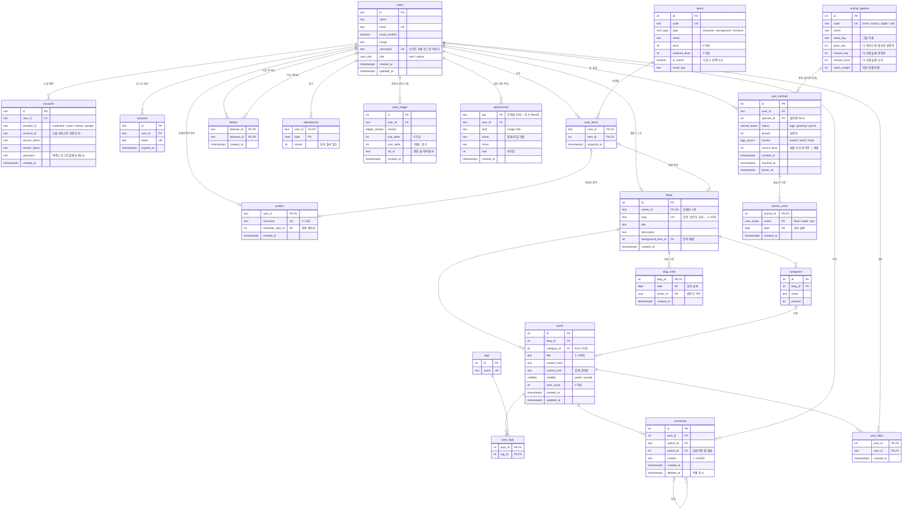

# Blogville ERD (데이터베이스 설계)

- DB: PostgreSQL
- 버전: 0.3 (2026-10-02, 사이트 자체 로그인·관리자 추가)
- 근거: [요구사항 명세서](01-requirements.md)

## 1. 전체 관계도



## 2. 테이블 그룹

| 그룹 | 테이블 | 관련 요구사항 |
|---|---|---|
| 인증 | `users`, `accounts`, `sessions`, `verifications` | AUTH |
| 회원·블로그 | `profiles`, `blogs`, `categories` | AUTH-02, BLOG |
| 글·교류 | `posts`, `tags`, `post_tags`, `comments`, `post_likes`, `follows` | POST, SOC |
| 아이템 | `items`, `user_items` | GAME-01, SHOP |
| 보상 | `attendances`, `point_ledger` | GAME-02~05 |
| 첨부 | `attachments` | POST-07, POST-09 |
| 방문자 | `blog_visits` | BLOG-06 |
| 동물 농장 | `animal_species`, `user_animals`, `animal_cares` | TOWN-09 |

인증 테이블 4개는 로그인 라이브러리(Better Auth)가 정한 구조를 따르고, 나머지는 직접 설계했다.
`verifications`는 로그인 과정의 임시 값을 담는 라이브러리 내부용이라 관계도에서 뺐다.

## 3. 설계 결정

### 3.1 회원과 프로필을 나눈 이유

`users`는 "로그인할 수 있는 사람", `profiles`는 "온보딩을 마친 마을 주민"이다.

- 소셜 로그인 직후에는 `users`만 있고 `profiles`가 없다 → **온보딩이 필요한 상태**를 별도 컬럼 없이 알 수 있다.
- 로그인 라이브러리 테이블을 건드리지 않아서, 라이브러리를 업데이트해도 우리 데이터 구조가 깨지지 않는다.

### 3.1-2 로그인 방식이 여러 개여도 회원은 하나

- 사이트 아이디로 가입하면 `users.username`에 아이디, `accounts`에 `provider_id = 'credential'` 행과 비밀번호 **해시**가 저장된다.
- 소셜 로그인은 같은 `accounts` 테이블에 `provider_id = 'kakao'` 같은 행으로 저장된다.
- 그래서 "회원 1명 ── 로그인 수단 N개" 구조가 된다. 비밀번호 원문은 어디에도 저장하지 않는다.
- 관리자는 `users.role = 'admin'`. 가입 요청으로는 바꿀 수 없고 관리자 생성 스크립트로만 정한다.

### 3.2 회원 한 명당 블로그 하나 (1:1)

`blogs.owner_id`에 **UNIQUE**를 걸어서 1:1 관계를 DB가 보장한다. (AUTH-01, BLOG-01)

### 3.3 장착은 "보유한 아이템"만: 복합 외래 키

`profiles.character_item_id`가 그냥 `items.id`를 가리키면, **사지 않은 아이템도 장착**할 수 있다.
그래서 `(user_id, character_item_id)` 두 컬럼을 묶어서 `user_items (user_id, item_id)`를 가리키게 한다.

```sql
FOREIGN KEY (user_id, character_item_id) REFERENCES user_items (user_id, item_id)
FOREIGN KEY (owner_id, background_item_id) REFERENCES user_items (user_id, item_id)
```

"보유한 것만 장착 가능"(SHOP-04)이라는 규칙을 앱 코드가 아니라 **DB가 직접 막는다.**
다만 "캐릭터 칸에는 캐릭터 아이템만"이라는 종류 검사는 서버 코드에서 한다.

### 3.4 코인과 경험치는 저장하지 않고 원장에서 계산 (정규화)

`profiles`에 `coins`, `exp` 컬럼을 두지 않는다. 대신 모든 변화를 `point_ledger`에 한 줄씩 쌓는다.

```sql
-- 현재 코인과 경험치
SELECT COALESCE(SUM(coin_delta), 0) AS coins,
       COALESCE(SUM(exp_delta), 0)  AS exp
FROM point_ledger WHERE user_id = $1;
```

- 잔액 컬럼과 기록이 어긋날 일이 없다. 은행 통장의 거래 내역과 같은 방식이다.
- "언제 무엇으로 얼마를 받았는지"를 그대로 보여줄 수 있다.
- **레벨도 저장하지 않는다.** 경험치 합계로 계산한다.

**레벨 공식**: 레벨 n이 되려면 누적 경험치 `50 × n × (n − 1)` 이상

| 레벨 | 1 | 2 | 3 | 4 | 5 | 10 |
|---|---|---|---|---|---|---|
| 필요 경험치 | 0 | 100 | 300 | 600 | 1,000 | 4,500 |

### 3.5 하루 상한과 출석

- **출석**: `attendances`의 기본 키가 `(user_id, date)`라서 같은 날 두 번 넣으면 DB가 거부한다. 버튼을 동시에 두 번 눌러도 한 번만 처리된다. (NF-05)
- **활동 보상 상한**: 오늘 같은 사유로 받은 보상 수를 `point_ledger`에서 세어 확인한다.

```sql
SELECT COUNT(*) FROM point_ledger
WHERE user_id = $1 AND reason = 'post' AND created_at >= 오늘 0시;
```

### 3.6 코인은 음수가 될 수 없다

구매는 **트랜잭션** 안에서 처리한다. (NF-04, SHOP-03)

```text
BEGIN
  1. pg_advisory_xact_lock(hashtext(user_id))  ← 이 회원의 보상·구매를 한 줄로 세운다
  2. 원장 합계로 잔액·레벨 계산
  3. 잔액 < 가격 또는 레벨 부족이면 중단
  4. user_items에 아이템 추가 (이미 있으면 기본 키 위반 → ROLLBACK)
  5. point_ledger에 coin_delta = -가격 기록
COMMIT
```

> 처음에는 원장 행을 `FOR UPDATE`로 잠그려 했지만, 원장은 "행을 추가"하는 테이블이라 아직 없는 행은 잠글 수 없다.
> 그래서 회원 ID로 만든 **advisory lock**(트랜잭션이 끝나면 자동으로 풀리는 이름표 잠금)을 쓴다.
> 같은 방식으로 출석, 글·댓글·공감 보상의 하루 상한 확인도 동시에 두 번 처리되지 않는다.

### 3.7 다대다(N:M) 관계

| 연결 테이블 | 잇는 것 | 기본 키 |
|---|---|---|
| `post_tags` | 글 ↔ 태그 | `(post_id, tag_id)` |
| `post_likes` | 글 ↔ 공감한 회원 | `(post_id, user_id)` → 한 글에 한 번만 공감 (SOC-03) |
| `user_items` | 회원 ↔ 아이템 | `(user_id, item_id)` → 같은 아이템 중복 보유 불가 |
| `follows` | 회원 ↔ 회원 (자기 참조) | `(follower_id, followee_id)` |

`follows`에는 `CHECK (follower_id <> followee_id)`로 자기 자신을 이웃 추가하지 못하게 한다.

### 3.8 삭제 규칙

| 지워지는 것 | 함께 처리 |
|---|---|
| 회원 | 프로필, 블로그, 글, 댓글, 공감, 원장, 첨부 정보 모두 삭제 (`CASCADE`) (AUTH-06). 저장소의 첨부 파일은 남는다 (POST-07 열린 질문) |
| 블로그 | 카테고리, 글 삭제 |
| 글 | 태그 연결, 댓글, 공감 삭제 |
| 카테고리 | 글은 남기고 `category_id`만 비움 (`SET NULL`) |
| 댓글 | 답글이 있을 수 있으니 행을 지우지 않고 `deleted_at`만 기록 ("삭제된 댓글입니다") |

### 3.9 열거형 (ENUM)

| 타입 | 값 |
|---|---|
| `user_role` | `user`, `admin` |
| `item_type` | `character`, `background`, `furniture` |
| `visibility` | `public`, `private` |
| `ledger_reason` | `signup`, `attendance`, `attendance_streak`, `post`, `comment`, `like_received`, `purchase`, `farm_care`, `farm_grown`, `egg_purchase` |
| `animal_status` | `egg`, `growing`, `grown` |
| `egg_source` | `starter`(농장 첫 알), `level`(5레벨마다), `shop`(코인으로 산 알) |
| `care_action` | `feed`(밥), `water`(물), `pet`(쓰다듬기) |

정해진 값만 들어가도록 PostgreSQL ENUM 타입을 쓴다. 어제 SQLite 블로그에서 `post_types` 코드 테이블로 했던 일을 DB 타입으로 처리하는 방법이다.

### 3.10 인덱스

| 인덱스 | 쓰이는 곳 |
|---|---|
| `posts (blog_id, created_at DESC)` | 블로그 홈 글 목록 |
| `posts (visibility, created_at DESC)` | 마을 최신 글 |
| `comments (post_id, created_at)` | 글 상세 댓글 |
| `point_ledger (user_id, reason, created_at)` | 잔액 계산, 하루 상한 확인 |
| `point_ledger (user_id, created_at DESC)` | 경험치·코인 내역 화면 최신순 (GAME-07, 마이그레이션 0003) |
| `follows (followee_id)` | 나를 이웃 추가한 사람 |
| `user_animals (user_id, status)` | 농장 화면, 키우는 알·동물 수(최대 5) 세기 (TOWN-09, 마이그레이션 0005) |
| `attachments (user_id, created_at)` | 회원을 지울 때 그 회원의 첨부 찾기, 나중에 양 제한·파일 정리 (POST-07, 마이그레이션 0004) |

### 3.11 첨부(사진·파일)는 파일과 정보를 나눠 둔다 (POST-07, POST-09)

- 파일 내용은 DB가 아니라 저장소(`src/server/storage.ts`, 지금은 서버 디스크 `UPLOAD_DIR`)에 두고, `attachments`에는 원래 이름·형식·크기와 올린 사람만 둔다. DB가 커지지 않고, 저장소를 바꿔도 테이블은 그대로다.
- `key`는 서버가 만든 무작위 32자(16진수)이고, 저장 이름이자 주소(`/files/키`)다. 올린 파일 이름을 주소·저장 이름에 쓰지 않아 덮어쓰기·경로 조작을 막는다. CHECK로 형식을 강제한다.
- 글 본문(`posts.content_html`)에는 ``, `<a href="/files/키" data-file …>`처럼 주소만 들어간다. 글과 첨부를 잇는 테이블은 두지 않았다. 저장할 때 본문의 키를 `attachments`에서 확인한다 (DB에 없는 키는 정화에서 뺀다).
- 내려받는 이름은 `attachments.name`(원래 이름)을 쓰므로, 본문을 조작해도 바뀌지 않는다.

### 3.12 방문자 수는 "사람·날짜마다 한 줄" (BLOG-06)

- `blog_visits` 기본 키 `(blog_id, date, visitor_id)`로 "같은 사람은 하루 1번"을 DB가 보장한다. 출석 `attendances (user_id, date)`와 같은 방식이다.
- 사람은 회원 ID가 아니라 방문자 쿠키(`bv_visitor`, 무작위 UUID)로 구별한다. 로그인하지 않은 방문자도 세야 하기 때문이다. IP는 저장하지 않는다 (NF-26).
- 숫자만 쌓는 `count` 컬럼을 두지 않은 이유: 이미 센 사람인지 알 수 없어 "하루 1번"을 지킬 수 없다. 오늘·전체는 `COUNT(*)`로 센다.
- 블로그가 지워지면 방문 기록도 지워진다 (`ON DELETE CASCADE`).

### 3.13 동물 농장: 상태에 따라 달라지는 규칙을 DB가 지킨다 (TOWN-09)

- **종류 표와 내 동물을 나눴다**: `animal_species`는 동물 종류 카탈로그(성장치·보상·부화 비중)이고, `user_animals`는 회원이 가진 알·동물 한 마리마다 한 줄이다. 종류마다 숫자가 달라서 코드 상수가 아니라 표로 뒀다 (`npm run db:seed`가 채운다).
- **알이면 종류가 없다**: 부화할 때 종류가 랜덤으로 정해지므로 알일 때 `species_id`는 비어 있다. 그래서 `user_animals`와 `animal_species`는 **비식별·선택(0..1)** 관계다. "알이면 비어 있고, 부화했으면 반드시 있다"는 CHECK로 막는다.

  ```sql
  CHECK ((status = 'egg') = (species_id IS NULL))
  ```

- **무료 알은 한 번만**: 농장 첫 알은 회원당 한 번, 레벨 보상 알은 레벨마다 한 번. 코인으로 산 알(`shop`)은 여러 번 가능해야 하므로 테이블 전체 UNIQUE가 아니라 **부분 고유 인덱스**를 쓴다.

  ```sql
  CREATE UNIQUE INDEX user_animals_starter_uq ON user_animals (user_id) WHERE source = 'starter';
  CREATE UNIQUE INDEX user_animals_level_uq ON user_animals (user_id, source_level) WHERE source = 'level';
  CHECK ((source = 'level') = (source_level IS NOT NULL))
  ```

- **돌보기는 동물마다·종류마다 하루 한 번**: `animal_cares`의 기본 키가 `(animal_id, action, date)`라서 같은 날 같은 돌보기를 두 번 넣으면 DB가 거부한다 → `user_animals`와 **식별 관계**. 출석 `attendances (user_id, date)`와 같은 방식이다.
- **동물은 자기 번호(`id`)가 있다**: 한 회원이 같은 종류를 여러 마리 키울 수 있고, 돌보기 기록과 원장(`point_ledger.ref_id`)이 동물 한 마리를 번호 하나로 가리켜야 하므로 회원과는 **비식별 관계**다.
- **보상은 원장에**: 돌보기 경험치(`farm_care`), 다 키운 보상(`farm_grown`, 종류 표의 숫자), 알 구매(`egg_purchase`, 코인 음수)는 모두 `point_ledger`에 쌓인다. 잔액 컬럼을 두지 않는 원칙(3.4)을 그대로 따른다.
- **"한 번에 5마리"는 코드가 지킨다**: 알·키우는 중 상태의 수를 세는 규칙이라 CHECK로는 표현할 수 없다. 회원 잠금(`lockUser`)을 건 트랜잭션 안에서 세고 넣는다.
- **삭제**: 회원이 지워지면 동물이, 동물이 지워지면 돌보기 기록이 함께 지워진다 (`ON DELETE CASCADE`). 동물 종류는 지우지 않는다 (참조 중이면 DB가 거부).

## 4. 데이터 마이그레이션

구조가 아니라 **데이터**를 바꿔야 할 때도 마이그레이션 파일로 남긴다. 그래야 팀원 각자의 DB와 배포 DB에 똑같이 적용된다.

| 파일 | 내용 |
|---|---|
| `0002_give_all_starters.sql` | GAME-01 결정(기본 캐릭터 3종 모두 지급)에 맞춰, 이미 온보딩을 마친 회원에게 없는 기본 캐릭터를 `user_items`에 채운다. `ON CONFLICT DO NOTHING`이라 여러 번 실행해도 중복되지 않는다 |

## 5. 남은 확인 사항

- **카카오 로그인 이메일**: 카카오는 이메일 제공이 선택 동의라 이메일이 없을 수 있다. 로그인 라이브러리가 이메일을 필수로 요구하는지 구현할 때 확인한다.
- **같은 블로그의 카테고리인지 검사**: 글의 `category_id`가 그 글의 블로그 카테고리인지는 서버 코드에서 검사한다.

## 부록: 컬럼 타입 상세

관계도에는 `text`·`int`처럼 크게 적었다. ERD를 그리거나 다른 DB로 옮길 때는 아래 **ERD 타입**을 쓴다.

**정하는 규칙**

| 값 | 타입 | 이유 |
|---|---|---|
| 자동 증가 번호 | `INTEGER` (IDENTITY), 원장만 `BIGINT` | 21억까지 충분. 원장은 활동마다 쌓여 가장 빨리 늘어난다 |
| 1~99 같은 작은 숫자 | `SMALLINT` | 32,767까지. 레벨, 일차, 순서 |
| 코인·경험치·크기 | `INTEGER` | 음수 가능한 것도 있음 (코인 변화) |
| 로그인 라이브러리 ID | `VARCHAR(32)` | 무작위 32자. **FK도 부모와 같은 타입** |
| 길이 제한이 정해진 글자 | `VARCHAR(n)` | n = 요구사항·CHECK의 최대 길이 |
| 길이가 항상 같은 글자 | `CHAR(n)` | 첨부 키, 세션 토큰 (32자) |
| 길이 제한이 없거나 아주 큰 글자 | `TEXT` | 글 본문, 소셜 토큰 |
| 정해진 값 중 하나 | `ENUM` | 3.9 |
| 날짜만 | `DATE` | 출석일, 방문일, 돌보기일 (한국 날짜) |
| 시각 | `TIMESTAMPTZ` | 시간대 포함. 모든 `*_at` |
| 무작위 식별자 | `UUID` | 방문자 쿠키 |

> **실제 DB와의 차이**: 지금 DB는 글자를 모두 `text` + 길이 CHECK로 저장한다. PostgreSQL에서는 `text`와 `varchar(n)`의 성능이 같고, 길이는 CHECK가 막는다. 그래서 DB는 그대로 두고, ERD에서는 의미가 잘 보이도록 아래 타입으로 적는다. 숫자도 DB는 `integer`이고 ERD에서 `SMALLINT`·`BIGINT`로 범위를 드러낸다.


**users (회원)**

| 컬럼 | ERD 타입 | 실제 DB | 비고 |
|---|---|---|---|
| `id` | `VARCHAR(32)` | `text` | 로그인 라이브러리가 만드는 무작위 32자 |
| `name` | `VARCHAR(100)` | `text` | 소셜 계정 이름. 길어도 100자 |
| `email` | `VARCHAR(254)` | `text` | 이메일 주소 최대 길이(표준 254자) |
| `email_verified` | `BOOLEAN` | `boolean` |  |
| `image` | `VARCHAR(2048)` | `text` | 프로필 사진 주소(URL) |
| `username` | `VARCHAR(20)` | `text` | 아이디 4~20자 (영문 소문자·숫자·_) |
| `display_username` | `VARCHAR(20)` | `text` | 아이디와 같은 길이 |
| `role` | `ENUM user_role` | `user_role` | user / admin |
| `created_at, updated_at` | `TIMESTAMPTZ` | `timestamptz` | 시간대를 포함한 시각 |

**accounts (로그인 수단)**

| 컬럼 | ERD 타입 | 실제 DB | 비고 |
|---|---|---|---|
| `id` | `VARCHAR(32)` | `text` |  |
| `user_id` | `VARCHAR(32)` | `text` | FK → users.id (같은 타입이어야 한다) |
| `provider_id` | `VARCHAR(20)` | `text` | credential / naver / kakao / google |
| `account_id` | `VARCHAR(255)` | `text` | 소셜 서비스 사용자 번호 |
| `access_token, refresh_token, id_token` | `TEXT` | `text` | 길이를 정할 수 없는 토큰 (구글 id_token은 1,000자 이상) |
| `access_token_expires_at, refresh_token_expires_at` | `TIMESTAMPTZ` | `timestamptz` |  |
| `scope` | `VARCHAR(500)` | `text` | 권한 목록 |
| `password` | `VARCHAR(255)` | `text` | 비밀번호 해시 (원문 아님) |
| `created_at, updated_at` | `TIMESTAMPTZ` | `timestamptz` |  |

**sessions (로그인 세션)**

| 컬럼 | ERD 타입 | 실제 DB | 비고 |
|---|---|---|---|
| `id` | `VARCHAR(32)` | `text` |  |
| `user_id` | `VARCHAR(32)` | `text` | FK → users.id |
| `token` | `CHAR(32)` | `text` | 쿠키에 담기는 값, 항상 32자 |
| `expires_at` | `TIMESTAMPTZ` | `timestamptz` | 로그인 7일 뒤 |
| `ip_address` | `VARCHAR(45)` | `text` | IPv6 최대 45자 (`INET`도 가능하지만 라이브러리가 문자열로 저장) |
| `user_agent` | `VARCHAR(512)` | `text` | 브라우저 정보 |
| `created_at, updated_at` | `TIMESTAMPTZ` | `timestamptz` |  |

**verifications (인증 임시 값)**

| 컬럼 | ERD 타입 | 실제 DB | 비고 |
|---|---|---|---|
| `id` | `VARCHAR(32)` | `text` |  |
| `identifier` | `VARCHAR(255)` | `text` | 무엇을 인증하는지 |
| `value` | `VARCHAR(255)` | `text` | 인증 값 |
| `expires_at, created_at, updated_at` | `TIMESTAMPTZ` | `timestamptz` |  |

**profiles (프로필)**

| 컬럼 | ERD 타입 | 실제 DB | 비고 |
|---|---|---|---|
| `user_id` | `VARCHAR(32)` | `text` | PK, FK → users.id |
| `nickname` | `VARCHAR(12)` | `text` | 2~12자 (CHECK) |
| `character_item_id` | `INTEGER` | `integer` | FK → items.id |
| `created_at` | `TIMESTAMPTZ` | `timestamptz` |  |

**blogs (블로그)**

| 컬럼 | ERD 타입 | 실제 DB | 비고 |
|---|---|---|---|
| `id` | `INTEGER (IDENTITY)` | `integer` | 자동 증가 |
| `owner_id` | `VARCHAR(32)` | `text` | FK → users.id, UNIQUE |
| `slug` | `VARCHAR(20)` | `text` | 3~20자 (CHECK 정규식) |
| `title` | `VARCHAR(40)` | `text` | 1~40자 |
| `description` | `VARCHAR(160)` | `text` | 소개 160자까지 (앱에서 확인) |
| `background_item_id` | `INTEGER` | `integer` | FK → items.id |
| `created_at, updated_at` | `TIMESTAMPTZ` | `timestamptz` |  |

**categories (카테고리)**

| 컬럼 | ERD 타입 | 실제 DB | 비고 |
|---|---|---|---|
| `id` | `INTEGER (IDENTITY)` | `integer` |  |
| `blog_id` | `INTEGER` | `integer` | FK → blogs.id |
| `name` | `VARCHAR(20)` | `text` | 1~20자 |
| `position` | `SMALLINT` | `integer` | 화면 순서 0, 1, 2… (블로그당 몇십 개) |

**posts (글)**

| 컬럼 | ERD 타입 | 실제 DB | 비고 |
|---|---|---|---|
| `id` | `INTEGER (IDENTITY)` | `integer` |  |
| `blog_id` | `INTEGER` | `integer` | FK |
| `category_id` | `INTEGER` | `integer` | FK, NULL 허용 |
| `title` | `VARCHAR(100)` | `text` | 1~100자 |
| `content_html` | `TEXT` | `text` | 글 본문 (최대 200,000자, 길이 상한이 커서 TEXT) |
| `content_text` | `TEXT` | `text` | 서식을 뺀 본문 |
| `visibility` | `ENUM visibility` | `visibility` | public / private |
| `view_count` | `INTEGER` | `integer` | 0 이상 |
| `created_at, updated_at` | `TIMESTAMPTZ` | `timestamptz` |  |

**tags (태그)**

| 컬럼 | ERD 타입 | 실제 DB | 비고 |
|---|---|---|---|
| `id` | `INTEGER (IDENTITY)` | `integer` |  |
| `name` | `VARCHAR(20)` | `text` | 태그 하나 20자까지 (앱에서 확인) |

**post_tags (글-태그)**

| 컬럼 | ERD 타입 | 실제 DB | 비고 |
|---|---|---|---|
| `post_id, tag_id` | `INTEGER` | `integer` | PK, FK |

**comments (댓글)**

| 컬럼 | ERD 타입 | 실제 DB | 비고 |
|---|---|---|---|
| `id` | `INTEGER (IDENTITY)` | `integer` |  |
| `post_id` | `INTEGER` | `integer` | FK |
| `author_id` | `VARCHAR(32)` | `text` | FK → users.id |
| `parent_id` | `INTEGER` | `integer` | FK → comments.id, NULL 허용 |
| `content` | `VARCHAR(1000)` | `text` | 1~1000자 |
| `created_at, deleted_at` | `TIMESTAMPTZ` | `timestamptz` | deleted_at은 NULL 허용 |

**post_likes (공감)**

| 컬럼 | ERD 타입 | 실제 DB | 비고 |
|---|---|---|---|
| `post_id` | `INTEGER` | `integer` | PK, FK |
| `user_id` | `VARCHAR(32)` | `text` | PK, FK |
| `created_at` | `TIMESTAMPTZ` | `timestamptz` |  |

**follows (이웃)**

| 컬럼 | ERD 타입 | 실제 DB | 비고 |
|---|---|---|---|
| `follower_id, followee_id` | `VARCHAR(32)` | `text` | PK, FK → users.id |
| `created_at` | `TIMESTAMPTZ` | `timestamptz` |  |

**items (아이템)**

| 컬럼 | ERD 타입 | 실제 DB | 비고 |
|---|---|---|---|
| `id` | `INTEGER (IDENTITY)` | `integer` |  |
| `code` | `VARCHAR(30)` | `text` | 예: bg_beach |
| `type` | `ENUM item_type` | `item_type` | character / background / furniture |
| `name` | `VARCHAR(30)` | `text` | 예: 바닷가 |
| `description` | `VARCHAR(200)` | `text` | NULL 허용 |
| `price` | `INTEGER` | `integer` | 코인 0 이상 |
| `required_level` | `SMALLINT` | `integer` | 1~99 (최고 레벨 99) |
| `is_starter` | `BOOLEAN` | `boolean` |  |
| `asset_key` | `VARCHAR(50)` | `text` | 예: bg.beach |
| `created_at` | `TIMESTAMPTZ` | `timestamptz` |  |

**user_items (보유 아이템)**

| 컬럼 | ERD 타입 | 실제 DB | 비고 |
|---|---|---|---|
| `user_id` | `VARCHAR(32)` | `text` | PK, FK |
| `item_id` | `INTEGER` | `integer` | PK, FK |
| `acquired_at` | `TIMESTAMPTZ` | `timestamptz` |  |

**attendances (출석, 지금 DB)**

| 컬럼 | ERD 타입 | 실제 DB | 비고 |
|---|---|---|---|
| `user_id` | `VARCHAR(32)` | `text` | PK, FK |
| `date` | `DATE` | `date` | 한국 날짜, 시각 없음 |
| `streak` | `SMALLINT` | `integer` | 연속 일수 1 이상 (변경안에서는 cycle_day 1~7) |

**point_ledger (경험치·코인 원장)**

| 컬럼 | ERD 타입 | 실제 DB | 비고 |
|---|---|---|---|
| `id` | `BIGINT (IDENTITY)` | `integer` | 활동마다 한 줄씩 가장 빨리 늘어나는 표라 넉넉하게 |
| `user_id` | `VARCHAR(32)` | `text` | FK |
| `reason` | `ENUM ledger_reason` | `ledger_reason` |  |
| `exp_delta` | `INTEGER` | `integer` | 0 이상 |
| `coin_delta` | `INTEGER` | `integer` | 음수 가능 |
| `ref_id` | `VARCHAR(32)` | `text` | 관련 글·아이템·동물·회원 ID를 글자로 (FK 아님) |
| `created_at` | `TIMESTAMPTZ` | `timestamptz` |  |

**attachments (첨부)**

| 컬럼 | ERD 타입 | 실제 DB | 비고 |
|---|---|---|---|
| `key` | `CHAR(32)` | `text` | 무작위 16진수 정확히 32자 (CHECK) |
| `user_id` | `VARCHAR(32)` | `text` | FK |
| `kind` | `VARCHAR(5)` | `text` | image / file (CHECK). ENUM으로 바꿔도 됨 |
| `name` | `VARCHAR(255)` | `text` | 원래 파일 이름 1~255자 |
| `mime` | `VARCHAR(100)` | `text` | 예: application/pdf |
| `size` | `INTEGER` | `integer` | 바이트, 최대 30MB = 31,457,280 (INTEGER 범위 안) |
| `created_at` | `TIMESTAMPTZ` | `timestamptz` |  |

**blog_visits (방문 기록)**

| 컬럼 | ERD 타입 | 실제 DB | 비고 |
|---|---|---|---|
| `blog_id` | `INTEGER` | `integer` | PK, FK |
| `date` | `DATE` | `date` | PK |
| `visitor_id` | `UUID` | `uuid` | PK, 방문자 쿠키 (이미 정확한 타입) |
| `created_at` | `TIMESTAMPTZ` | `timestamptz` |  |

**animal_species (동물 종류)**

| 컬럼 | ERD 타입 | 실제 DB | 비고 |
|---|---|---|---|
| `id` | `INTEGER (IDENTITY)` | `integer` |  |
| `code` | `VARCHAR(20)` | `text` | 예: chick |
| `name` | `VARCHAR(20)` | `text` | 예: 아기 돼지 |
| `asset_key` | `VARCHAR(50)` | `text` | 예: animal.chick |
| `grow_exp, reward_exp, reward_coins` | `INTEGER` | `integer` | 성장치·보상 |
| `hatch_weight` | `SMALLINT` | `integer` | 부화 비중 (몇십 단위) |

**user_animals (내 알·동물)**

| 컬럼 | ERD 타입 | 실제 DB | 비고 |
|---|---|---|---|
| `id` | `INTEGER (IDENTITY)` | `integer` |  |
| `user_id` | `VARCHAR(32)` | `text` | FK |
| `species_id` | `INTEGER` | `integer` | FK, 알이면 NULL |
| `status` | `ENUM animal_status` | `animal_status` | egg / growing / grown |
| `growth` | `INTEGER` | `integer` | 0 이상 |
| `source` | `ENUM egg_source` | `egg_source` | starter / level / shop |
| `source_level` | `SMALLINT` | `integer` | 5, 10, … 99 이하 |
| `created_at, hatched_at, grown_at` | `TIMESTAMPTZ` | `timestamptz` | hatched_at·grown_at은 NULL 허용 |

**animal_cares (돌보기 기록)**

| 컬럼 | ERD 타입 | 실제 DB | 비고 |
|---|---|---|---|
| `animal_id` | `INTEGER` | `integer` | PK, FK |
| `action` | `ENUM care_action` | `care_action` | PK, feed / water / pet |
| `date` | `DATE` | `date` | PK |
| `created_at` | `TIMESTAMPTZ` | `timestamptz` |  |

